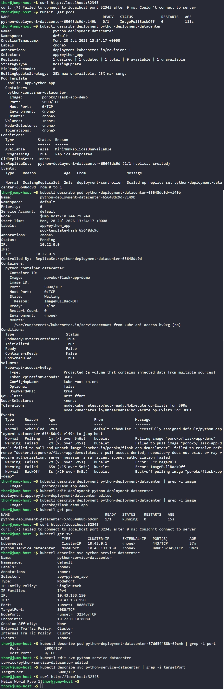

# Day 64: Fix Python App Deployed on Kubernetes Cluster


## Objective
The objective was to troubleshoot and fix a broken Python Flask application on the Kubernetes cluster. I had to identify why the application was failing to start and why it was unreachable through the specified NodePort, then correct the configuration in both the Deployment and the Service.

## 1. Troubleshooting

I followed a debugging process to find the two main errors:

**Issue 1: Incorrect Image Name**
I checked the pods and saw `ImagePullBackOff`. I ran `kubectl describe pod` and found that the deployment was trying to pull `poroko/flask-app-demo`. According to the requirements, the correct image is `poroko/flask-demo-app`. The names were swapped.

**Issue 2: targetPort Mismatch**
After fixing the image, the pod was running, but I still couldn't reach the app via `curl`. I inspected the service and the pod:
*   The Service was configured with a `targetPort` of **8080**.
*   I ran `kubectl describe pod` and saw the container was actually listening on port **5000**.
Because of this mismatch the service was forwarding traffic to port 8080 instead of the Flask's 5000, the app never received the traffic.

## 2. Resolution Steps

I applied the fixes by editing the cluster resources directly.

**Step A: Fix the Deployment Image**
I edited the deployment to use the correct image name.
```bash
kubectl edit deployment python-deployment-datacenter
# Changed image from poroko/flask-app-demo to poroko/flask-demo-app
```

**Step B: Fix the Service targetPort**
I edited the service to route traffic to the correct container port.
```bash
kubectl edit svc python-service-datacenter
# Changed targetPort from 8080 to 5000
```

## 3. Final Verification

I verified that the new pod was running and tested the network connection from the jump-host.

```bash
# Check if pod is Running
kubectl get pods

# Test the NodePort
curl http://localhost:32345
```

### Result
The `curl` command successfully returned: `Hello World Pyvo 1!`. Both the image naming error and the port routing mismatch are now resolved.

**Image Pulling**
Kubernetes needs an exact path to a container image to download it. If there is a typo in the name or the version tag, the cluster cannot find the "blueprint" for the app, leading to an `ImagePullBackOff` error.

**Port Chain (NodePort -> Port -> targetPort)**
For a web app to work, the pipe for traffic must be perfectly aligned:
1.  **NodePort:** The external door on the physical server (32345).
2.  **Port:** The internal door of the Service.
3.  **targetPort:** The door on the actual container where the app is listening. The service sends traffic to port 8080 but the app is listening on 5000, the connection is refused.

## Screenshot
