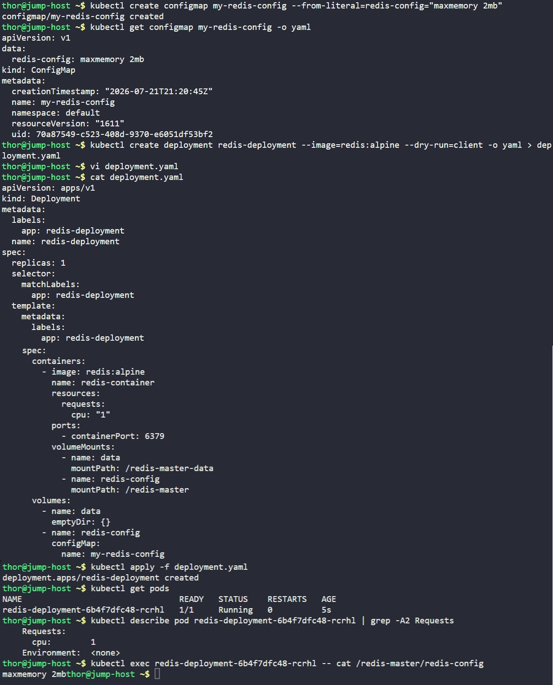

# Day 65: Deploy Redis Deployment on Kubernetes


## Objective
The objective was to deploy a Redis in-memory caching service on the Kubernetes cluster to address performance issues. I created a ConfigMap to handle the Redis settings and a Deployment that ensures the service has guaranteed CPU resources and persistent-like temporary storage.


**ConfigMaps**
A ConfigMap is a way to store configuration settings separately from the application code or the container image. Instead of hardcoding "maxmemory 2mb" inside the Redis image, I stored it in a ConfigMap. This makes it easy to change settings in the future without rebuilding the entire application.

**Resource Requests**
By setting a CPU request of "1", I am telling Kubernetes that this Redis container MUST have at least one full CPU core reserved for it. This prevents other applications on the same server from stealing the processing power Redis needs to stay fast.

**Multiple Volume Mounts**
I used two different types of volumes in one Pod:
*   **emptyDir:** A temporary scratchpad on the node's disk for Redis to store its active data.
*   **configMap Volume:** Takes the settings I saved in the cluster and injects them into the container as a real file that the application can read at startup.


## 1. Created the ConfigMap
I created the `my-redis-config` ConfigMap to store the specific memory limit required by the development team.

```bash
kubectl create configmap my-redis-config --from-literal=redis-config="maxmemory 2mb"
```

## 2. Developed the Redis Deployment
I created the `deployment.yaml` file to define the Redis container, its resource requirements, and how the volumes should be attached.

```yaml
apiVersion: apps/v1
kind: Deployment
metadata:
  labels:
    app: redis-deployment
  name: redis-deployment
spec:
  replicas: 1
  selector:
    matchLabels:
      app: redis-deployment
  template:
    metadata:
      labels:
        app: redis-deployment
    spec:
      containers:
        - image: redis:alpine
          name: redis-container
          resources:
            requests:
              cpu: "1"
          ports:
            - containerPort: 6379
          volumeMounts:
            - name: data
              mountPath: /redis-master-data
            - name: redis-config
              mountPath: /redis-master
      volumes:
        - name: data
          emptyDir: {}
        - name: redis-config
          configMap:
            name: my-redis-config
```

## 3. Verification
I applied the manifest and performed three checks to ensure the deployment was perfect.

```bash
# Applying the manifest
kubectl apply -f deployment.yaml

# 1. Check if the Pod is Running
kubectl get pods

# 2. Check if the CPU request is assigned
kubectl describe pod | grep -A2 Requests

# 3. Check if the config file is actually inside the container
kubectl exec pod -- cat /redis-master/redis-config
```

### Result
I verified that the Pod is **Running**. The resource check confirmed that **1 CPU** is successfully requested, and the `exec` command showed that the configuration file exists with the content `maxmemory 2mb`. Redis is now ready for testing.

## Screenshot
