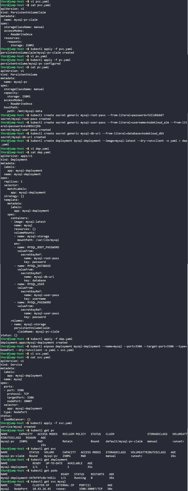

# Day 66: Deploy MySQL on Kubernetes


## Objective
The objective is to deploy a fully functional MySQL server on the Kubernetes cluster. I configured persistent storage so database records are not lost if the Pod restarts, used Kubernetes Secrets to safely handle passwords, and created a Service to make the database accessible on a specific network port.

## 1. Architecture

**Decoupled Storage (PV & PVC)**
Database data is critical. I used a **PersistentVolume (PV)** to define a slice of storage on the node's disk and a **PersistentVolumeClaim (PVC)** to allow the MySQL deployment to claim that space. This ensures the data in `/var/lib/mysql` lives on the physical hardware, not just inside the temporary container memory.

**Secrets for Security**
Hardcoding passwords in YAML files is a security risk. I used **Secrets** to act as a secure vault. I created three separate secret objects to store the root password, the application username/password, and the database name.

**Secret Mapping to Environment Variables**
MySQL containers expect specific environment variables (like `MYSQL_ROOT_PASSWORD`) to initialize the database. Instead of writing the password directly, I mapped these variables to the Keys inside my Secrets. The container pulls the values from the cluster's secure storage at runtime.

## 2. Created Persistent Storage
I created the storage layer first to ensure MySQL has a place to write data immediately upon starting.

```yaml
# pv.yaml
apiVersion: v1
kind: PersistentVolume
metadata:
  name: mysql-pv
spec:
  storageClassName: manual
  capacity:
    storage: 250Mi
  accessModes:
    - ReadWriteOnce
  hostPath:
    path: /mnt/mysql-data
```

```yaml
# pvc.yaml
apiVersion: v1
kind: PersistentVolumeClaim
metadata:
  name: mysql-pv-claim
spec:
  storageClassName: manual
  accessModes:
    - ReadWriteOnce
  resources:
    requests:
      storage: 250Mi
```

## 3. Created Kubernetes Secrets
I created the three required secrets using imperative commands to store the sensitive database credentials.

```bash
# Root Password Secret
kubectl create secret generic mysql-root-pass --from-literal=password=YUIidhb667

# User Credentials Secret
kubectl create secret generic mysql-user-pass --from-literal=username=kodekloud_aim --from-literal=password=ksH85UJjhb

# Database Name Secret
kubectl create secret generic mysql-db-url --from-literal=database=kodekloud_db5
```

## 4. Deployed MySQL
I created the `dep.yaml` file. This manifest links the container to the PVC for storage and pulls all necessary login info from the Secrets created in the previous step.

```yaml
# dep.yaml
apiVersion: apps/v1
kind: Deployment
metadata:
  name: mysql-deployment
spec:
  replicas: 1
  selector:
    matchLabels:
      app: mysql-deployment
  template:
    metadata:
      labels:
        app: mysql-deployment
    spec:
      containers:
        - image: mysql:latest
          name: mysql
          volumeMounts:
            - name: mysql-storage
              mountPath: /var/lib/mysql
          env:
            - name: MYSQL_ROOT_PASSWORD
              valueFrom:
                secretKeyRef:
                  name: mysql-root-pass
                  key: password
            - name: MYSQL_DATABASE
              valueFrom:
                secretKeyRef:
                  name: mysql-db-url
                  key: database
            - name: MYSQL_USER
              valueFrom:
                secretKeyRef:
                  name: mysql-user-pass
                  key: username
            - name: MYSQL_PASSWORD
              valueFrom:
                secretKeyRef:
                  name: mysql-user-pass
                  key: password
      volumes:
        - name: mysql-storage
          persistentVolumeClaim:
            claimName: mysql-pv-claim
```

## 5. Configured NodePort Service
I created the `svc.yaml` to expose MySQL to the cluster network and the external host.

```yaml
# svc.yaml
apiVersion: v1
kind: Service
metadata:
  name: mysql
spec:
  type: NodePort
  ports:
    - port: 3306
      targetPort: 3306
      nodePort: 30007
  selector:
    app: mysql-deployment
```

## 6. Verification
I applied all manifests and checked the status of each component.

```bash
kubectl apply -f pv.yaml
kubectl apply -f pvc.yaml
kubectl apply -f dep.yaml
kubectl apply -f svc.yaml

# Check Storage binding
kubectl get pv
kubectl get pvc

# Check Pod and Service status
kubectl get pods
kubectl get svc mysql
```

### Result
I verified that the PVC successfully **Bound** to the PV. The MySQL Pod reached a **Running** state, successfully initializing the `kodekloud_db5` database using the credentials provided via Secrets. The service is now listening on NodePort **30007**.

## Screenshot
