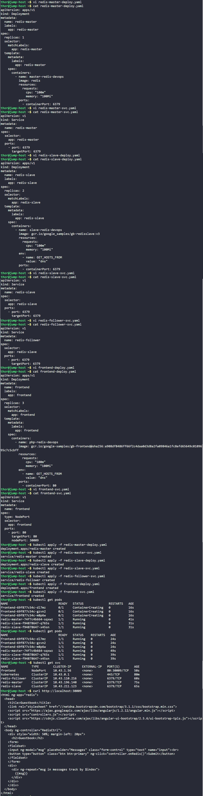

# Day 67: Deploy Guest Book App on Kubernetes


## Objective
The objective is to deploy a multi-tier application called "Guestbook" on the Kubernetes cluster. This involves setting up a Backend tier using Redis (with a Master for writing data and Slaves for reading/scaling data) and a Frontend tier using PHP to serve the web interface to users.

## 1. Architecture:


**The Backend Tier (Database)**
*   **Redis Master:** This is the single source of truth where all new data is written. Because there is only one, I used a deployment with 1 replica.
*   **Redis Slaves:** These are the Assistants. They copy data from the Master and answer read requests. If thousands of people look at the guestbook, the Slaves handle that load so the Master doesn't get overwhelmed. I used 2 replicas here for better performance.
*   **The Follower Service:** I created a specific service named `redis-follower` that points to the slaves. This acts as a single internal phone number the frontend can call whenever it needs to read something.

**The Frontend Tier (Web Server)**
This is what the user actually sees. It is a PHP application. Since this is the busiest part of the app, I scaled it to 3 replicas. This means if one container crashes or gets too much traffic, the other two keep the website alive.

**Service Discovery (GET_HOSTS_FROM: dns)**
The containers need to talk to each other. By setting the environment variable `GET_HOSTS_FROM` to `dns`, I am telling the application: Don't look for IP addresses; just ask the cluster for the names 'redis-master' or 'redis-follower'. Kubernetes handles the address book (DNS) automatically.

**NodePort vs ClusterIP**
*   I used **ClusterIP** for the Redis Master and Slaves because they are private. They should only talk to other containers inside the cluster.
*   I used **NodePort** (port 30009) for the Frontend because it needs to be public. It opens a specific door on the cluster nodes so I can reach the website from my browser.

## 2. Deployed the Redis Master (Backend)
I created the master deployment and a service so other pods can find it.

```yaml
# redis-master-deploy.yaml
apiVersion: apps/v1
kind: Deployment
metadata:
  name: redis-master
spec:
  replicas: 1
  selector:
    matchLabels:
      app: redis-master
  template:
    metadata:
      labels:
        app: redis-master
    spec:
      containers:
      - name: master-redis-devops
        image: redis
        ports:
        - containerPort: 6379
        resources:
          requests:
            cpu: "100m"
            memory: "100Mi"
```

```yaml
# redis-master-svc.yaml
apiVersion: v1
kind: Service
metadata:
  name: redis-master
spec:
  ports:
  - port: 6379
    targetPort: 6379
  selector:
    app: redis-master
```

## 3. Deployed the Redis Slaves (Backend)
I deployed the slaves and linked them to the master using the `dns` environment variable.

```yaml
# redis-slave-deploy.yaml
apiVersion: apps/v1
kind: Deployment
metadata:
  name: redis-slave
spec:
  replicas: 2
  selector:
    matchLabels:
      app: redis-slave
  template:
    metadata:
      labels:
        app: redis-slave
    spec:
      containers:
      - name: slave-redis-devops
        image: gcr.io/google_samples/gb-redisslave:v3
        env:
        - name: GET_HOSTS_FROM
          value: "dns"
        ports:
        - containerPort: 6379
        resources:
          requests:
            cpu: "100m"
            memory: "100Mi"
```

I then created two services for the slaves to handle different naming requirements from the app:

```yaml
# redis-slave-svc.yaml
apiVersion: v1
kind: Service
metadata:
  name: redis-slave
spec:
  ports:
  - port: 6379
  selector:
    app: redis-slave
```

```yaml
# redis-follower-svc.yaml
apiVersion: v1
kind: Service
metadata:
  name: redis-follower
spec:
  ports:
  - port: 6379
    targetPort: 6379
  selector:
    app: redis-slave
```

## 4. Deployed the Frontend (Web Tier)
I deployed the PHP frontend with 3 replicas and exposed it via NodePort 30009.

```yaml
# frontend-deploy.yaml
apiVersion: apps/v1
kind: Deployment
metadata:
  name: frontend
spec:
  replicas: 3
  selector:
    matchLabels:
      app: frontend
  template:
    metadata:
      labels:
        app: frontend
    spec:
      containers:
      - name: php-redis-devops
        image: gcr.io/google-samples/gb-frontend@sha256:a908df8486ff66f2c4daa0d3d8a2fa09846a1fc8efd65649c0109695c7c5cbff
        env:
        - name: GET_HOSTS_FROM
          value: "dns"
        ports:
        - containerPort: 80
        resources:
          requests:
            cpu: "100m"
            memory: "100Mi"
```

```yaml
# frontend-svc.yaml
apiVersion: v1
kind: Service
metadata:
  name: frontend
spec:
  type: NodePort
  ports:
  - port: 80
    targetPort: 80
    nodePort: 30009
  selector:
    app: frontend
```

## 5. Verification
I applied all manifests and checked the status of the entire stack.

```bash
kubectl apply -f redis-master-deploy.yaml 
kubectl apply -f redis-master-svc.yaml
kubectl apply -f redis-slave-deploy.yaml 
kubectl apply -f redis-slave-svc.yaml 
kubectl apply -f redis-follower-svc.yaml
kubectl apply -f frontend-deploy.yaml 
kubectl apply -f frontend-svc.yaml


# Testing the frontend connectivity
curl http://localhost:30009
```

### Result
I verified that all 6 Pods (1 Master, 2 Slaves, 3 Frontends) reached the **Running** state. The `curl` command returned the HTML source of the Guestbook app, confirming that the frontend is correctly communicating with the backend services.

## Screenshot
