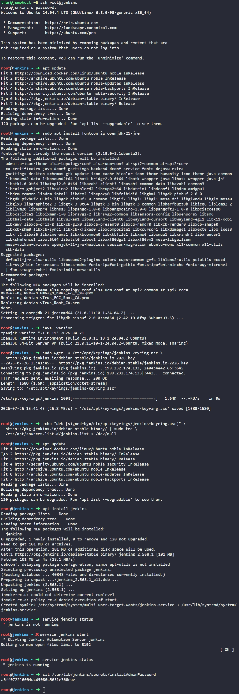
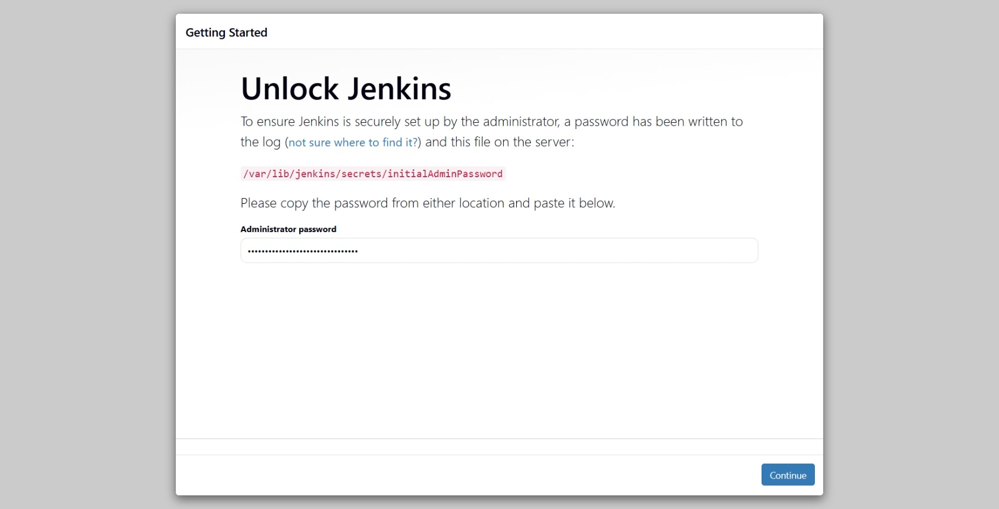
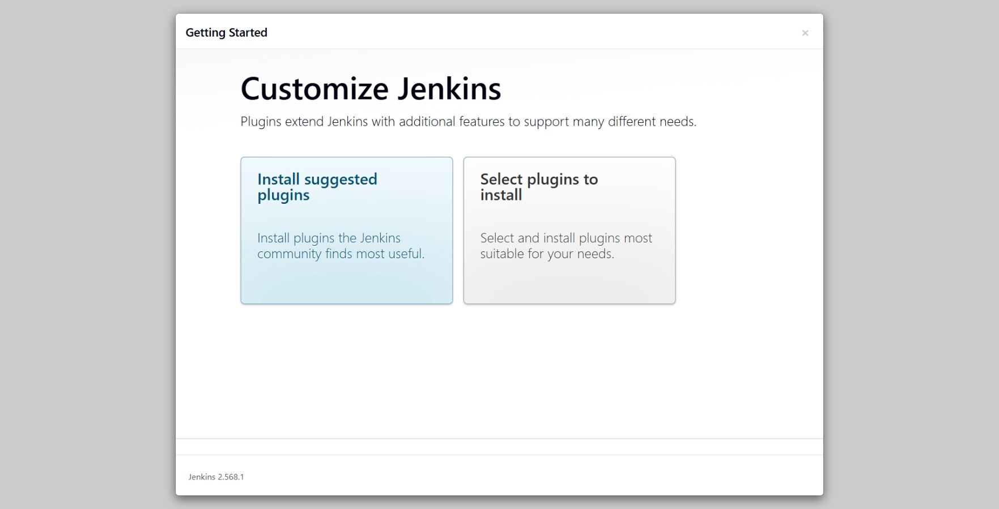
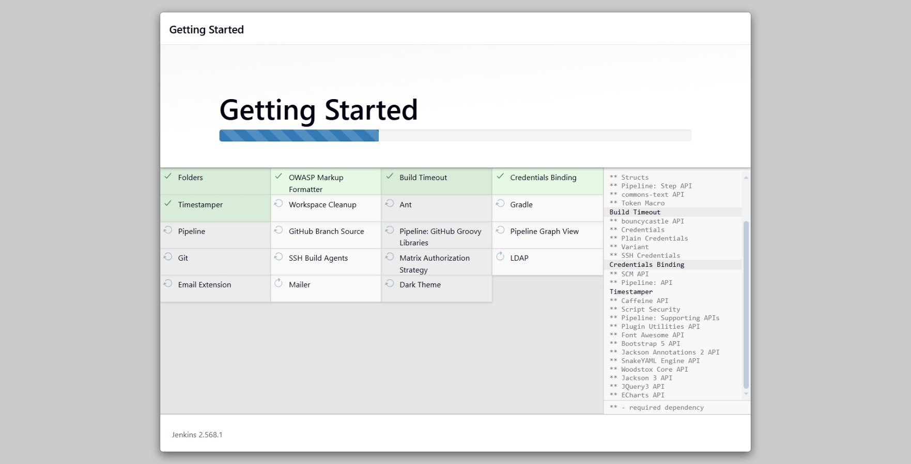
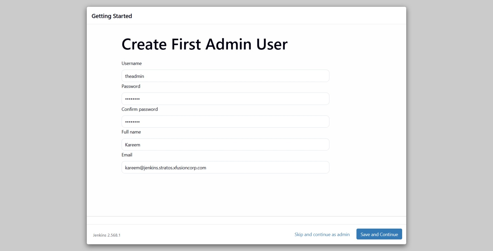
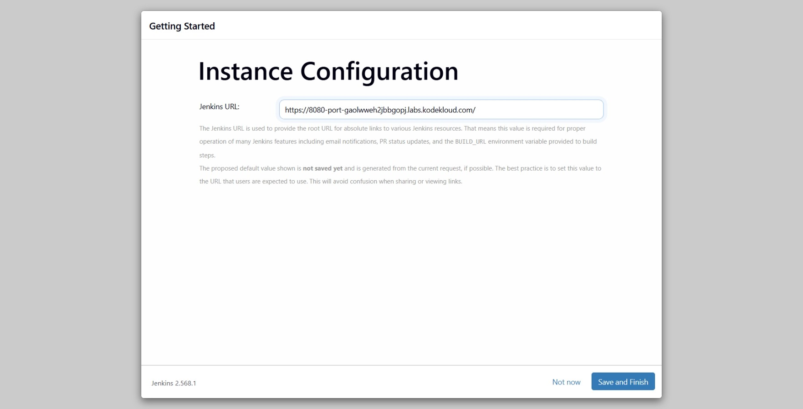
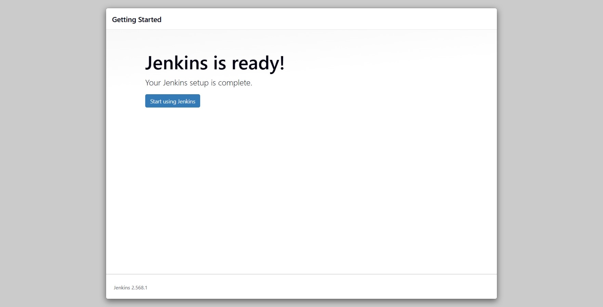
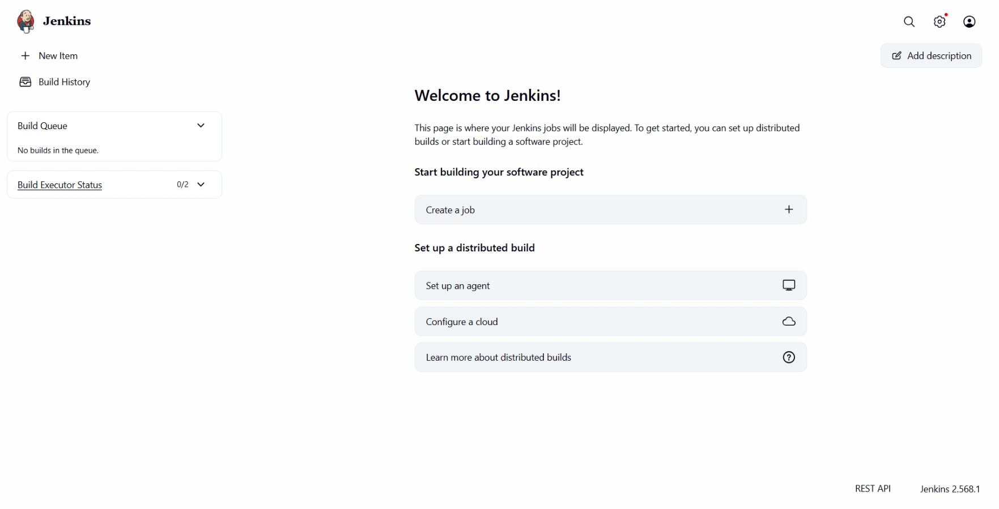

# Day 68: Set Up Jenkins Server

# Day 68: Set Up Jenkins Server

## Objective
The objective is to install and initialize a Jenkins server on a dedicated Ubuntu node. This setup serves as the foundation for the DevOps team's CI/CD pipelines, allowing for automated building, testing, and deployment of applications.

## 1. Connected to the Jenkins Server
I accessed the server from the jump host using the provided root credentials.

```bash
ssh root@jenkins
# Password: S3curePass
```

## 2. Installed Java Runtime
I updated the package repositories and installed the required Java version.

```bash
apt update
sudo apt install -y fontconfig openjdk-21-jre
java -version
```

## 3. Configured Jenkins Repository
Because Jenkins is not in the default Ubuntu repositories, I added the official Jenkins GPG key and repository source to the system.

```bash
# Add GPG key
sudo wget -O /etc/apt/keyrings/jenkins-keyring.asc https://pkg.jenkins.io/debian-stable/jenkins.io-2023.key

# Add the repository to sources list
echo "deb [signed-by=/etc/apt/keyrings/jenkins-keyring.asc] https://pkg.jenkins.io/debian-stable binary/ | sudo tee /etc/apt/sources.list.d/jenkins.list > /dev/null"

apt update
```

## 4. Installed and Started Jenkins
I installed the Jenkins package and initialized the service using the `service` command.

```bash
apt install -y jenkins

# Start the service
service jenkins start

# Verify status
service jenkins status
```

## 6. Retrieved Administrative Secret
To complete the setup in the Web UI, I retrieved the initial administrator password.

```bash
cat /var/lib/jenkins/secrets/initialAdminPassword
```
**Secret Found:** `a6ff972216004dcd9980c5631e360eae`

## 7. Final Web UI Configuration
I accessed the Jenkins UI via the browser and configured the primary administrative account with the following details:
*   **Username:** `theadmin`
*   **Password:** `Adm!n321`
*   **Full Name:** `Kareem`
*   **Email:** `kareem@jenkins.stratos.xfusioncorp.com`

### Result
I verified that Jenkins is running and the administrative user is successfully created. The server is now ready to host automation jobs and CI/CD pipelines.

## Screenshot







