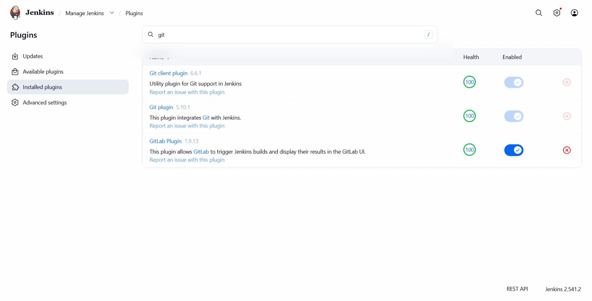

# Day 69: Install Jenkins Plugins

## Objective
The objective is to extend the functionality of the Jenkins server by installing essential plugins. These plugins allow Jenkins to integrate with version control systems like Git and GitLab, which is a requirement for automating CI/CD pipelines.

## 1. Accessed Jenkins UI
I clicked the Jenkins button on the top bar and logged in with the administrative credentials provided:
*   **Username:** `admin`
*   **Password:** `Adm!n321`

## 2. Navigated to Plugin Manager
I moved to the management section of the server to handle the installation.
*   Path: **Manage Jenkins** > **Plugins** > **Available plugins**

## 3. Installed Git and GitLab Plugins
I performed the following actions in the Web UI:
1.  Searched for "Git" in the search bar.
2.  Selected the **Git plugin**.
3.  Searched for "GitLab" and selected the **GitLab plugin**.
4.  Clicked **Install without restart**

## 4. Verification
After the server restarted, I logged back in and navigated to the **Installed plugins** tab to confirm the status.

### Result
I verified that both the **Git plugin** and the **GitLab plugin** are listed as "Enabled" with a healthy status. Jenkins is now capable of pulling source code from repositories and triggering builds based on GitLab events.

## Screenshot
