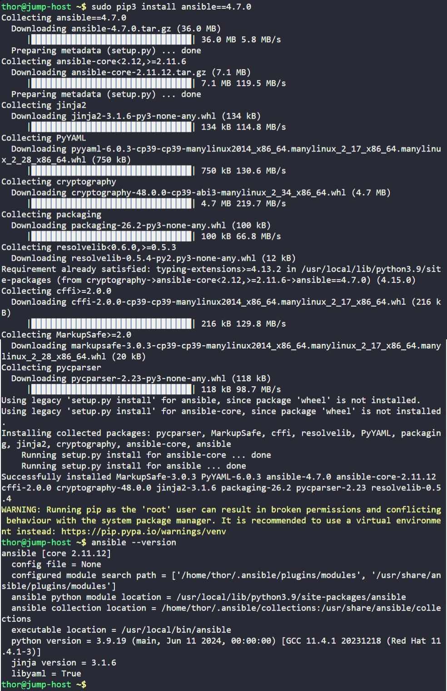

# Day 8: Install Ansible

## Objective

Installing `Ansible` version `4.7.0` on the jump hosting using **pip3** and ensuring the Ansible command is available globally so all users on the system can execute it.

## What is Ansible

Ansible is an automation tool used to manage multiple servers from a single control machine.

It allows us to:

- Run commands on multiple servers at once
- Automate software installation
- Configure systems
- Deploy applications

Ansible is:

- **Agentless:** connects to the servers using SSH and does not require an agent on remote machines
- **Simple:** uses YAML files (playbooks) for automation scripts
- **Idempotent:** running same task multiple times gives same result only executing chenges when needed
- **Modular:** uses reusable built-in modules (install, copy, service, etc.) instead of relying on raw shell commands

## Ways to Use Ansible

1. **Ad-hoc commands:** quick one-line tasks

```bash
ansible all -m ping
ansible all -m shell -a "uptime"
```

2. **Playbooks:** structured automation scripts in YAML

```yaml
- hosts: all
  tasks:
    - name: check uptime
      command: uptime
```

Run with the command:
```bash
ansible-playbook play.yml
```

## Screenshot

