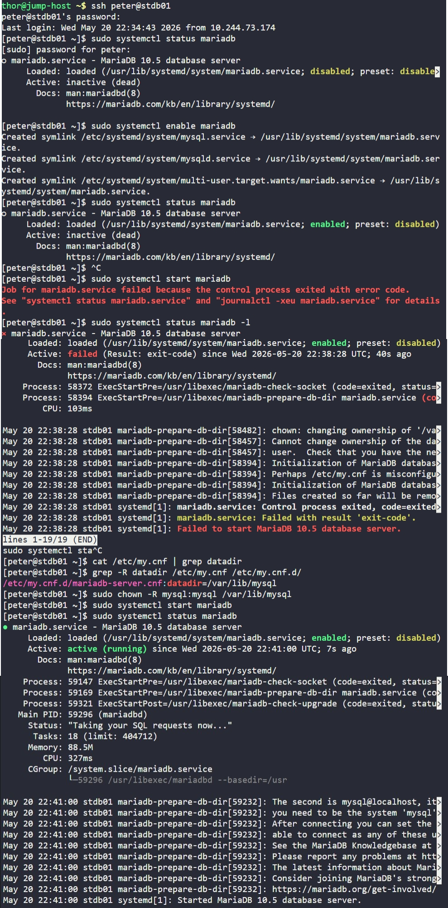

# Day 9: MariaDB Troubleshooting

## Objective

Identifying and fixing the issue causing the mariadb service to be down on the database server.

### Root Cause

MariaDB could not initialize properly because the database directory `/var/lib/mysql` did not have the correct ownership required by the mysql user

### Resolution
- Corrected ownership of MariaDB data directory
- Successfully restarted mariadb service
- Restored database connectivity for the Nautilus application


## Process

## 1. Connected to the Database Server
```bash
ssh peter@stdb01
```


## 2. Checked MariaDB Service Status
```bash
sudo systemctl status mariadb
```
Result
```bash
Active: inactive (dead)
```
MariaDB service was not running.


## 3. Attempted to Start MariaDB
```bash
sudo systemctl start mariadb
```
Result
```bash
Job for mariadb.service failed because the control process exited with error code.
```
The service failed during startup.


## 4. Investigated Detailed Error Logs
```bash
sudo systemctl status mariadb -l
```
Important Error Messages
```bash
Cannot change ownership of the database directory
Initialization of MariaDB database failed
Perhaps /etc/my.cnf is misconfigured
```
This errors logs indicated a permissions/ownership issue related to the MariaDB data directory.


## 5. Identified MariaDB Data Directory

MariaDB stores its databases and internal files inside a directory called the data directory (datadir).
This location is defined inside MariaDB configuration files.

To find it:

```bash
grep -R datadir /etc/my.cnf /etc/my.cnf.d/
```

- `grep`: searches for text inside files
- `-R`: recursive search through directories
- `datadir`: keyword being searched
- `/etc/my.cnf` and `/etc/my.cnf.d/`: MariaDB configuration files/directories

Result
```bash
datadir=/var/lib/mysql
```

This showed that MariaDB stores its database files in:
```bash
/var/lib/mysql
```


## 6. Fixed Ownership Issue

MariaDB service runs internally as the Linux system user **mysql**

Therefore, the mysql user must own the database directory and files in order to:
- create databases
- write logs
- manage tables
- initialize database files

The error logs showed MariaDB could not change ownership or access the data directory properly.

To fix this:

```bash
sudo chown -R mysql:mysql /var/lib/mysql
```

- `chown`: changes ownership of files/directories
- `-R`: recursive (all files/subdirectories)
- `mysql:mysql`
    - first mysql = owner user
    - second mysql = owner group
    - /var/lib/mysql = MariaDB data directory

This restored correct ownership to hte mysql user so that the MariaDB service could now access and initialize its database files properly.


## 7. Started MariaDB Service Again
```bash
sudo systemctl start mariadb
```
Now the service started successfully

8. Verified Service Status
```bash
sudo systemctl status mariadb
```
Result
```bash
active (running)
```


## Screenshots

