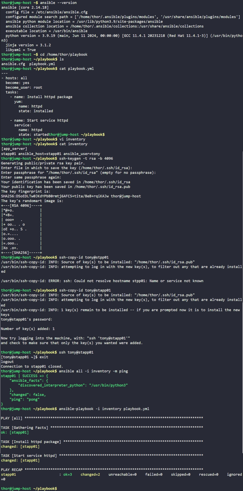

# Day 82: Create Ansible Inventory for App Server Testing

## Objective
The objective is to set up an Ansible configuration and inventory file on the jump host to test deployment playbooks on App Server 1 (`stapp01`). This involves defining host variables, setting up passwordless SSH authentication, and running the playbook successfully without extra arguments.

## 1. Ansible Inventories

**The Phone Book**

Ansible needs to know which servers to manage, how to reach them, and what credentials to use. The **Inventory File** acts like a phone book. Instead of typing server IP addresses and usernames every time, I group servers together (e.g., `[app_server]`) and define their connection parameters directly inside the inventory.

**Agentless Automation**

Unlike tools that require software installed on the target nodes, Ansible is **agentless**. It connects to target servers over standard SSH, pushes temporary Python scripts, executes them, and cleans them up. Therefore, setting up an SSH key pair (`ssh-copy-id`) from the jump host to the target node is a mandatory prerequisite for Ansible to work smoothly.

## 2. Created the Inventory File
I navigated to the playbook directory on the jump host and created an INI-style inventory file containing `stapp01` along with the necessary connection variables (`ansible_host` and `ansible_user`).

```bash
cd /home/thor/playbook
vi inventory
```

**Inventory Content (`inventory`):**
```ini
[app_server]
stapp01 ansible_host=stapp01 ansible_user=tony
```

## 3. Configured Passwordless SSH
To allow Ansible to run commands on `stapp01` without prompting for a password, I generated an SSH key pair on the jump host and copied the public key to the target server.

```bash
# Generated SSH key pair
ssh-keygen -t rsa -b 4096 -N ""

# Copied the public key to tony@stapp01
ssh-copy-id tony@stapp01
```

## 4. Tested Connection and Executed Playbook
I verified that Ansible could successfully connect to the inventory host using the built-in `ping` module, and then executed the provided deployment playbook.

```bash
# Test connection via Ansible ping module
ansible all -i inventory -m ping

# Run the playbook without extra arguments
ansible-playbook -i inventory playbook.yml
```

### Result
The `ping` module returned a successful `"pong"` response, and the `ansible-playbook` run finished with `failed=0`. The `httpd` package was successfully installed and started on `stapp01` as verified by the playbook summary.

## Screenshot
