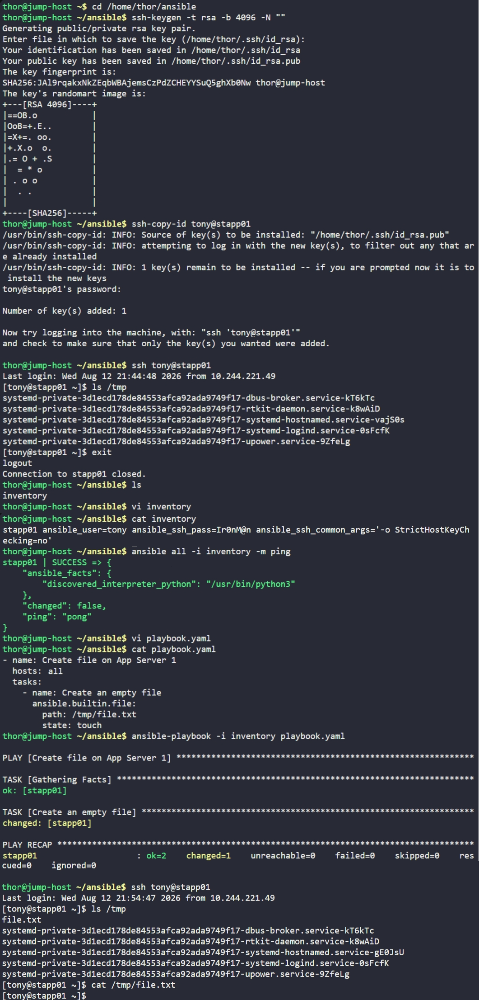

# Day 83: Troubleshoot and Create Ansible Playbook


## Objective
The objective was to finalize an Ansible configuration on the jump host to automate a file creation task on App Server 1 (`stapp01`). I needed to adjust the existing inventory file and create a new playbook to ensure the infrastructure state matches the development team's requirements.


## 1. Updated the Inventory File
I modified the `/home/thor/ansible/inventory` file to define the target host and the connection parameters.

```ini
stapp01 ansible_user=tony ansible_ssh_pass=IronM@n ansible_ssh_common_args='-o StrictHostKeyChecking=no'
```

I verified the connection using the ad-hoc ping command:
```bash
ansible all -i inventory -m ping
# Result: stapp01 | SUCCESS => {"ping": "pong"}
```

## 3. Developed the Playbook
I created the `playbook.yml` file as requested. I targeted `stapp01` and used the `file` module to handle the creation of the target path.

```yaml
# playbook.yml
- name: Create file on App Server 1
  hosts: all
  tasks:
    - name: Create an empty file
      ansible.builtin.file:
        path: /tmp/file.txt
        state: touch
```

## 2. Execution and Verification
I executed the playbook using the standard command to apply the changes to the remote server.

```bash
ansible-playbook -i inventory playbook.yml
```

**Observation:**
The task returned `changed: [stapp01]`, indicating that Ansible successfully created the file because it wasn't already there.

**Manual Verification:**
I logged into the App Server to confirm the file exists in the `/tmp` directory.
```bash
ssh tony@stapp01
ls -l /tmp/file.txt
```

### Result
The task is complete. I successfully configured the inventory and wrote a declarative playbook that ensures `/tmp/file.txt` is present on the application server. The automation is idempotent, meaning I can run this playbook multiple times without causing errors or duplicate files.

## Screenshot
