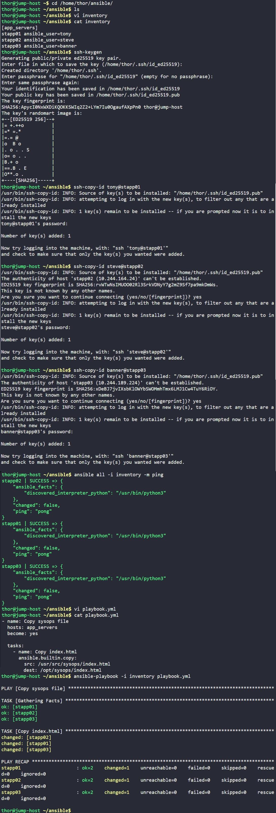

# Day 84: Copy Data to App Servers using Ansible


## Objective
The objective is to automate the distribution of a specific file from the jump host to all three application servers (`stapp01`, `stapp02`, and `stapp03`) using Ansible. This ensures that static content is updated across the entire fleet simultaneously and consistently.


**Managed Nodes (The Fleet)**
In this setup, I am managing a group of three different servers. By defining them under a single group name (`app_servers`) in the inventory, I can send commands to all of them at once. This is the core power of Ansible: scaling a single manual task (like a file copy) to hundreds of servers instantly.

**The Copy Module**
I used the `ansible.builtin.copy` module. Unlike a standard Linux `scp` command, the Ansible copy module is **idempotent**. 
* If the file on the app server is already identical to the one on the jump host, Ansible will do nothing (status: `ok`).
* If the file is missing or different, Ansible will update it (status: `changed`).
This prevents unnecessary data transfer and ensures the server state matches the source exactly.

**Elevation of Privileges (`become: yes`)**
Since the destination directory (`/opt/sysops/`) is a restricted system path, the standard user accounts (tony, steve, banner) do not have write access. I used the `become: yes` directive to tell Ansible to use `sudo` on the remote servers to perform the file transfer with root privileges.

## 1. Created the Inventory File
I created an INI-style inventory file to map the hostnames to their respective SSH usernames.

```ini
# /home/thor/ansible/inventory
[app_servers]
stapp01 ansible_user=tony
stapp02 ansible_user=steve
stapp03 ansible_user=banner
```

## 2. Configured SSH Trust
Ansible requires a non-interactive connection to run automation. I generated an SSH key pair and distributed the public key to all three managed nodes.

```bash
# Generated the key pair
ssh-keygen

# Distributed keys to the fleet
ssh-copy-id tony@stapp01
ssh-copy-id steve@stapp02
ssh-copy-id banner@stapp03
```

I verified the connection using the ping module:
```bash
ansible all -i inventory -m ping
# Result: SUCCESS for stapp01, stapp02, and stapp03
```

## 3. Developed the Copy Playbook
I wrote the `playbook.yml` to define the source file on the jump host and the target destination on the application servers.

```yaml
# /home/thor/ansible/playbook.yml
- name: Copy sysops file
  hosts: app_servers
  become: yes

  tasks:
    - name: Copy index.html
      ansible.builtin.copy:
        src: /usr/src/sysops/index.html
        dest: /opt/sysops/index.html
```

## 4. Execution and Verification
I executed the playbook to push the file to the entire cluster.

```bash
ansible-playbook -i inventory playbook.yml
```

### Result
The execution log showed `changed: [stapp01]`, `changed: [stapp02]`, and `changed: [stapp03]`. This confirms that the file was successfully delivered to all three servers. The automation ensured that the file was placed in a protected directory across different user environments (tony, steve, banner) using a single command.

## Screenshot
