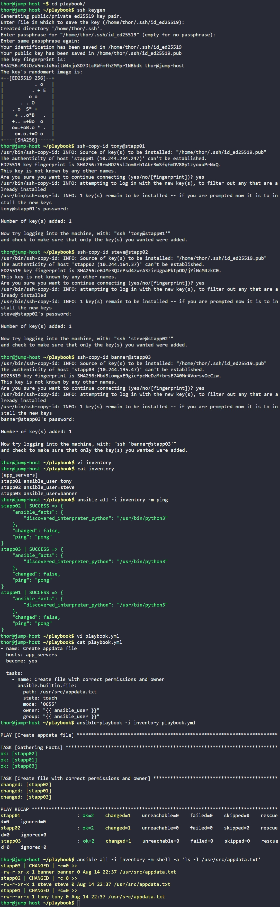

# Day 85: Create Files on App Servers using Ansible

## Objective
The objective is to use Ansible to create an empty file named `appdata.txt` in a protected system directory (`/usr/src/`) on all application servers. The task requires setting specific file permissions and ensuring the file owner matches the specific user of each server (tony, steve, or banner).


**The File Module as a Template**

I used the `ansible.builtin.file` module. Instead of me manually logging into each server and typing `touch`, `chmod`, and `chown`, I define the design of the file in my playbook. Ansible then carries this to every server in the inventory and applies it.

**Dynamic Ownership via Variables**

A challenge here was that the owner needs to be different on every server. I utilized the **`ansible_user`** variable. Since I already defined who the user is for each server in my inventory, I can tell Ansible: Set the owner of the file to whoever you logged in as. This makes the playbook reusable across different servers without hardcoding names.

**Privilege Escalation**

Because `/usr/src` is a system-level directory, a regular user cannot create files there. I used **`become: yes`** to tell Ansible to use `sudo` to perform the administrative work.

## 1. Created the Inventory File
I created the inventory file on the jump host to define the connection details.

```ini
# ~/playbook/inventory
[app_servers]
stapp01 ansible_user=tony
stapp02 ansible_user=steve
stapp03 ansible_user=banner
```

## 2. Setup SSH Trust
I generated a security key and shared it with all servers so Ansible could work without asking for passwords.

```bash
ssh-keygen
ssh-copy-id tony@stapp01
ssh-copy-id steve@stapp02
ssh-copy-id banner@stapp03
```

## 3. Developed the Playbook
I wrote the `playbook.yml` to define the file state. I used the curly brace syntax `{{ }}` to grab the username dynamically from the inventory.

```yaml
# ~/playbook/playbook.yml
- name: Create appdata file
  hosts: app_servers
  become: yes

  tasks:
    - name: Create file with correct permissions and owner
      ansible.builtin.file:
        path: /usr/src/appdata.txt
        state: touch
        mode: '0655'
        owner: "{{ ansible_user }}"
        group: "{{ ansible_user }}"
```

## 4. Execution and Verification
I ran the playbook and then used an ad-hoc command to verify the permissions and ownership across the fleet.

```bash
# Run the automation
ansible-playbook -i inventory playbook.yml

# Check the results on all servers
ansible all -i inventory -m shell -a 'ls -l /usr/src/appdata.txt'
```

### Result
The verification output showed that the file was created successfully on all three servers:
*   **stapp01:** Owned by `tony`
*   **stapp02:** Owned by `steve`
*   **stapp03:** Owned by `banner`
*   **Permissions:** All set to `-rw-r-xr-x` (0655).

The environment is now consistent and follows the security requirements for the application data folder.

## Screenshot
