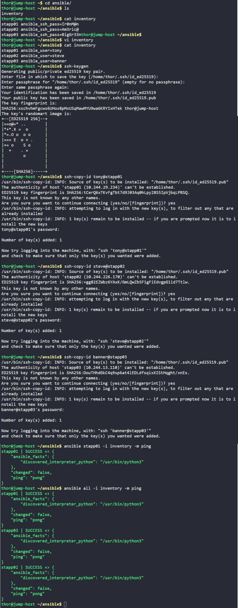

# Day 86: Ansible Ping Module Usage

## Objective
The objective is to establish a secure, password-less SSH connection between the jump host (Ansible controller) and the application servers in the Stratos DC. This setup is a prerequisite for running automated playbooks, which I verified using the Ansible ping module.

## 1. Updated the Inventory File
I modified the `/home/thor/ansible/inventory` file to remove the insecure `ansible_ssh_pass` variables and define the correct SSH users for each managed node.

```ini
stapp01 ansible_user=tony
stapp02 ansible_user=steve
stapp03 ansible_user=banner
```

## 2. Setup Password-less SSH Authentication
I generated a new SSH key pair on the jump host and distributed the public key to all three application servers to enable non-interactive automation.

```bash
# Generated ED25519 key pair
ssh-keygen

# Copied the public key to managed nodes
ssh-copy-id tony@stapp01
ssh-copy-id steve@stapp02
ssh-copy-id banner@stapp03
```

## 3. Verified Connectivity with Ping Module
I used the Ansible `ping` module to confirm that the controller could successfully authenticate and communicate with the managed nodes. Unlike a network ping, this module verifies that Ansible can log in and execute Python code on the targets.

```bash
# Test connectivity to App Server 1 specifically
ansible stapp01 -i inventory -m ping

# Test connectivity to all the servers
ansible all -i inventory -m ping
```

### Result
I verified that all servers returned a `"ping": "pong"` success message. This confirms that the SSH trust is correctly established and the environment is ready for playbook execution.

## Screenshot
