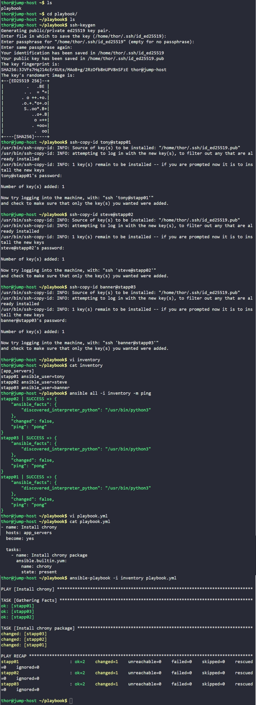

# Day 87: Ansible Install Package

## Objective
The objective is to automate the installation of the `chrony` package across all application servers in the Stratos Datacenter. I used Ansible to ensure consistent configuration management and verified that the task was completed using an idempotent playbook.


## 1. Setup SSH Trust
I started by ensuring the jump host could communicate with all managed nodes without manual password entry.

```bash
# Generated SSH keys on jump host
ssh-keygen

# Distributed keys to the app servers
ssh-copy-id tony@stapp01
ssh-copy-id steve@stapp02
ssh-copy-id banner@stapp03
```

## 2. Created the Inventory File
I created the `/home/thor/playbook/inventory` file to group the servers and define their specific login users.

```ini
[app_servers]
stapp01 ansible_user=tony
stapp02 ansible_user=steve
stapp03 ansible_user=banner
```

## 3. Developed the Installation Playbook
I wrote the `playbook.yml` to target the `app_servers` group and utilize the yum module for package management.

```yaml
---
- name: Install chrony
  hosts: app_servers
  become: yes

  tasks:
    - name: Install chrony package
      ansible.builtin.yum:
        name: chrony
        state: present
```

## 4. Execution and Verification
I executed the playbook from the jump host using the inventory file.

```bash
# Test connectivity first
ansible all -i inventory -m ping

# Run the playbook
ansible-playbook -i inventory playbook.yml
```

### Result
I verified the execution, the status returned `changed` for all servers. The package is now successfully installed across the entire fleet, ensuring all servers can synchronize their system clocks correctly.

## Screenshot
