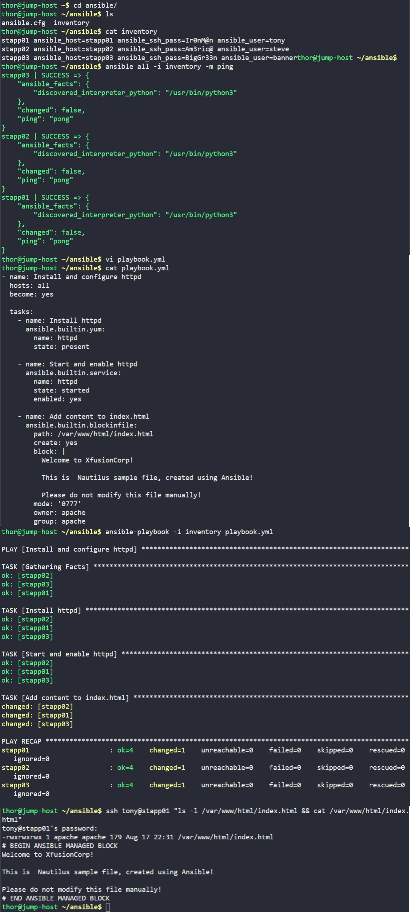

# Day 88: Ansible Blockinfile Module


## Objective
The objective is to automate the installation and configuration of an Apache (`httpd`) web server across the server fleet using Ansible. I used the `blockinfile` module to deploy a specific multi-line landing page while ensuring strict ownership and permission requirements are met.

## 1. Verified the Inventory
I started by checking the existing inventory file to ensure the connection strings and credentials for the application servers were correct.

```bash
cat /home/thor/ansible/inventory
```
```ini
stapp01 ansible_host=stapp01 ansible_ssh_pass=Ir0nM@n ansible_user=tony
stapp02 ansible_host=stapp02 ansible_ssh_pass=Am3ric@ ansible_user=steve
stapp03 ansible_host=stapp03 ansible_ssh_pass=BigGr33n ansible_user=banner
```

I verified connectivity using an ad-hoc ping:
```bash
ansible all -i inventory -m ping
```

## 2. Developed the Playbook
I created the `playbook.yml` file to handle the software installation, service management, and file deployment in a single automated run.

```yaml
# /home/thor/ansible/playbook.yml
- name: Install and configure httpd
  hosts: all
  become: yes

  tasks:
    - name: Install httpd
      ansible.builtin.yum:
        name: httpd
        state: present

    - name: Start and enable httpd
      ansible.builtin.service:
        name: httpd
        state: started
        enabled: yes

    - name: Add content to index.html
      ansible.builtin.blockinfile:
        path: /var/www/html/index.html
        create: yes
        block: |
          Welcome to XfusionCorp!

          This is  Nautilus sample file, created using Ansible!

          Please do not modify this file manually!
        mode: '0777'
        owner: apache
        group: apache
```

## 3. Execution and Verification
I executed the playbook and then logged into one of the app servers to manually verify the state of the web page.

```bash
# Run the playbook
ansible-playbook -i inventory playbook.yml

# Check the file state on stapp01
ssh tony@stapp01 "ls -l /var/www/html/index.html && cat /var/www/html/index.html"
```

### Result
I verified that the Apache service is active and the `index.html` file was successfully created with the following attributes:
*   **Permissions:** `-rwxrwxrwx` (0777)
*   **Ownership:** User `apache`, Group `apache`
*   **Content:** Correctly wrapped within the Ansible managed markers.

The web server is now fully configured and serving the managed content across all nodes.

## Screenshot
