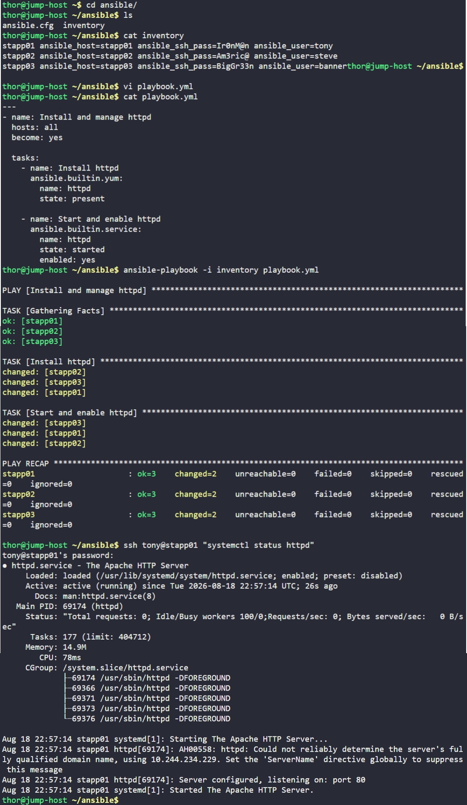

# Day 89: Ansible Manage Services


## Objective
The objective is to automate the installation and management of the Apache (`httpd`) service across all application servers using Ansible. I developed a playbook to ensure the software is installed, active, and configured to start automatically upon system boot.


## 1. Developed the Ansible Playbook
I created the `playbook.yml` file on the jump host to orchestrate the software lifecycle.

```yaml
# /home/thor/ansible/playbook.yml
---
- name: Install and manage httpd
  hosts: all
  become: yes

  tasks:
    - name: Install httpd
      ansible.builtin.yum:
        name: httpd
        state: present

    - name: Start and enable httpd
      ansible.builtin.service:
        name: httpd
        state: started
        enabled: yes
```

## 2. Execution and Verification
I executed the playbook using the existing inventory file and then manually verified the service status on one of the managed nodes.

```bash
# Execute the playbook
ansible-playbook -i inventory playbook.yml

# Check the service state on App Server 1
ssh tony@stapp01 "systemctl status httpd"
```

### Result
I verified that the `httpd` service is **active (running)** and **enabled**. The playbook execution was successful across the entire fleet (`stapp01`, `stapp02`, `stapp03`), ensuring a consistent web server environment without manual intervention on each host.

## Screenshot
