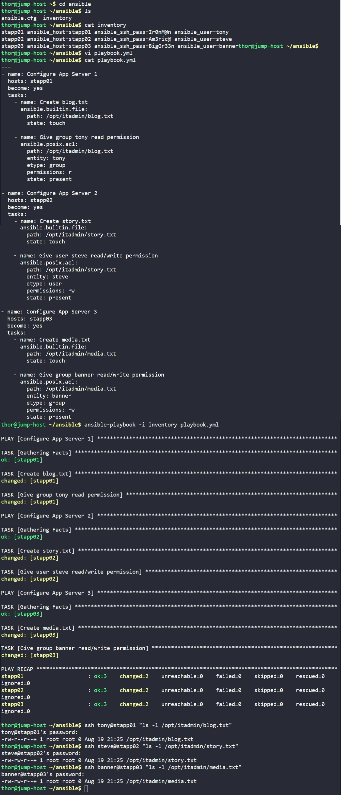

# Day 90: Managing ACLs Using Ansible


## Objective
The objective is to create specific files on the application servers and manage access using Access Control Lists (ACLs). This allows me to keep the files owned by `root` while granting precise, granular permissions to specific users or groups without changing the standard Linux ownership model.

## 1. ACLs vs. Standard Permissions

**Standard Permissions (The "Broad" Model)**
In standard Linux, permissions are limited to the Owner, the Group, and Everyone Else (UGO). If a file is owned by `root:root`, I can only give access to another user by either changing the group to their name or giving everyone else access, which is a security risk.

**Access Control Lists**
I used the **`ansible.posix.acl`** module to implement a more flexible security policy. It allows me to keep the file owned by `root` but explicitly invite a specific user (like `steve`) or a specific group (like `tony`) to have their own set of read or write rights. 

**The "+" Indicator**
In the terminal output, we can see a **`+`** sign at the end of the permission string (e.g., `-rw-rw-r--+`). This is the system's way of telling us that the standard UGO permissions are being augmented by an ACL.

## 2. Developed the Ansible Playbook
I created the `playbook.yml` file to handle the file creation and ACL assignment for each server individually, ensuring each one received the correct "invitation list."

```yaml
# /home/thor/ansible/playbook.yml
---
- name: Configure App Server 1
  hosts: stapp01
  become: yes
  tasks:
    - name: Create blog.txt
      ansible.builtin.file:
        path: /opt/itadmin/blog.txt
        state: touch

    - name: Give group tony read permission
      ansible.posix.acl:
        path: /opt/itadmin/blog.txt
        entity: tony
        etype: group
        permissions: r
        state: present

- name: Configure App Server 2
  hosts: stapp02
  become: yes
  tasks:
    - name: Create story.txt
      ansible.builtin.file:
        path: /opt/itadmin/story.txt
        state: touch

    - name: Give user steve read/write permission
      ansible.posix.acl:
        path: /opt/itadmin/story.txt
        entity: steve
        etype: user
        permissions: rw
        state: present

- name: Configure App Server 3
  hosts: stapp03
  become: yes
  tasks:
    - name: Create media.txt
      ansible.builtin.file:
        path: /opt/itadmin/media.txt
        state: touch

    - name: Give group banner read/write permission
      ansible.posix.acl:
        path: /opt/itadmin/media.txt
        entity: banner
        etype: group
        permissions: rw
        state: present
```

## 3. Execution and Verification
I executed the playbook using the local inventory and verified the results by logging into the remote hosts to check for the ACL indicators.

```bash
# Run the automation
ansible-playbook -i inventory playbook.yml

# Verify the ACL marker (+) on the files
ssh tony@stapp01 "ls -l /opt/itadmin/blog.txt"
ssh steve@stapp02 "ls -l /opt/itadmin/story.txt"
ssh banner@stapp03 "ls -l /opt/itadmin/media.txt"
```

### Result
I verified that all files are owned by **`root`**. The presence of the `+` sign and the specific permission bits (like `-rw-rw-r--+`) confirm that:
*   Group `tony` has read access on `blog.txt`.
*   User `steve` has read/write access on `story.txt`.
*   Group `banner` has read/write access on `media.txt`.

The configuration is now secure and exactly matches the requested access policy.

## Screenshot
