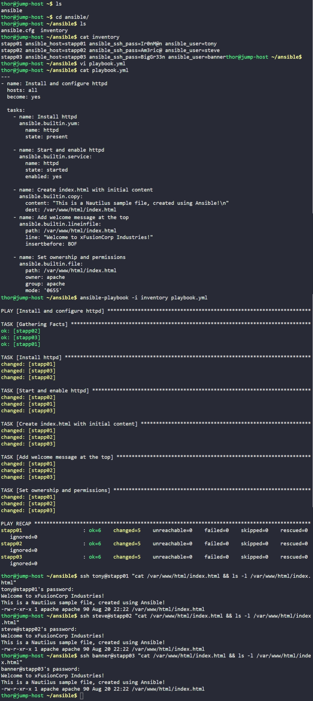

# Day 91: Ansible Lineinfile Module


## Objective
The objective is to automate the installation of the Apache web server across the server fleet and perform surgical text edits on the landing page using Ansible. I used the `lineinfile` module to ensure a specific welcome message appears at the very top of the website's index file, while maintaining strict security permissions and ownership.

## Lineinfile and File Positioning

**lineinfile**

While modules like `copy` or `template` replace an entire file, the **`lineinfile`** module is used for making precise changes to existing files. It is like a "Find and Replace" tool for automation. We use it when we want to ensure a specific line exists in a file without overwriting the other data already there.

**Positioning with BOF (Beginning of File)**

Standard file appending adds text to the bottom. In this task, I used the **`insertbefore: BOF`** parameter. 
*   `BOF` tells Ansible to lift the first page and slide the new content underneath it at the very top. This is critical for configuration files where the order of instructions matters, or for headers in documentation.

**State Enforcement**

By combining `copy` (for initial content) and `lineinfile` (for the header), I ensured the file was built in stages. Then, I used the `file` module as the "final inspector" to set the permissions to `0655` and the ownership to the `apache` service account, ensuring the web server can read the file but cannot be exploited through it.

## 2. Developed the Ansible Playbook
I created the `playbook.yml` file to handle the full lifecycle of the web service and its content.

```yaml
# /home/thor/ansible/playbook.yml
---
- name: Install and configure httpd
  hosts: all
  become: yes

  tasks:
    - name: Install httpd
      ansible.builtin.yum:
        name: httpd
        state: present

    - name: Start and enable httpd
      ansible.builtin.service:
        name: httpd
        state: started
        enabled: yes

    - name: Create index.html with initial content
      ansible.builtin.copy:
        content: "This is a Nautilus sample file, created using Ansible!\n"
        dest: /var/www/html/index.html

    - name: Add welcome message at the top
      ansible.builtin.lineinfile:
        path: /var/www/html/index.html
        line: "Welcome to xFusionCorp Industries!"
        insertbefore: BOF

    - name: Set ownership and permissions
      ansible.builtin.file:
        path: /var/www/html/index.html
        owner: apache
        group: apache
        mode: '0655'
```

## 3. Execution and Verification
I ran the playbook using the existing inventory and then used SSH commands to verify the content order and file attributes on all app servers.

```bash
# Execute the playbook
ansible-playbook -i inventory playbook.yml

# Verify the file on stapp01, stapp02, and stapp03
ssh tony@stapp01 "cat /var/www/html/index.html && ls -l /var/www/html/index.html"
ssh steve@stapp02 "cat /var/www/html/index.html && ls -l /var/www/html/index.html"
ssh banner@stapp03 "cat /var/www/html/index.html && ls -l /var/www/html/index.html"
```

### Result
I verified that on all servers, the `index.html` file was correctly formatted:
*   **Line 1:** `Welcome to xFusionCorp Industries!` (Inserted at BOF)
*   **Line 2:** `This is a Nautilus sample file, created using Ansible!`
*   **Ownership:** User `apache`, Group `apache`.
*   **Permissions:** `-rw-r-xr-x` (0655).

The automation successfully deployed the web server and configured the site content exactly as requested, demonstrating the power of surgical text manipulation with Ansible.

## Screenshot
