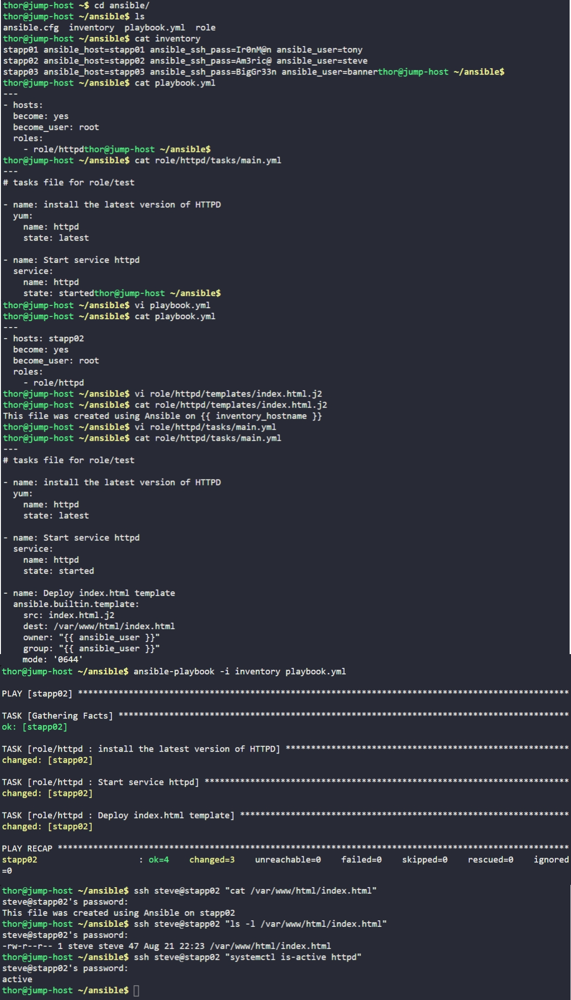

# Day 92: Managing Jinja2 Templates Using Ansible

## Objective

The objective is to utilize Jinja2 templating within an Ansible role to deploy dynamic web content. I updated an existing `httpd` role to generate a unique `index.html` file for App Server 2 (`stapp02`) that automatically identifies the host it is running on using Ansible's internal variables.


**Ansible Roles**

Instead of writing one long playbook file that handles everything, a Role allows us to organize our work into dedicated folders, each can contain a specific task like installing Apache on a server:
*   **`tasks/`**: Contains the "To-Do" list (e.g., install the package, start the service).
*   **`templates/`**: Holds the dynamic Jinja2 files that need to be "filled in" before deployment.

**Modularity and Reuse**

The power of Roles is that they are modular. I can now hand this `httpd` toolkit to any server in the cluster just by referencing it in the main playbook. This keeps the configuration clean and easy to maintain as the infrastructure grows.

**Jinja2**

Jinja2 template is like a Fill-in-the-Blanks document. Instead of writing a static `index.html` for every server in the datacenter, I write one template file (`.j2`). Inside this file, I use double curly braces `{{ }}` to mark spots where Ansible should plug in real-world data at the moment the playbook runs.

**Variable Interpolation**

I used two built-in variables:
*   **`inventory_hostname`**: This tells Ansible to look at the name of the server in the inventory (e.g., `stapp02`) and write it into the file. This avoids the risk of human error from hard-coding names.
*   **`ansible_user`**: This ensures the file ownership is dynamically set to the correct sudo user (like `steve`) regardless of which server the role is applied to.

**The Template Module**

Unlike the `copy` module, which moves a file exactly as it is, the **`template`** module "renders" the file first. Ansible reads the `.j2` file, replaces the variables with actual values, and then saves the final result on the target server.

## 1. Updated the Main Playbook
I updated `playbook.yml` by specifying `stapp02` in hosts to ensure the `httpd` role targets the correct host (App Server 2).

```yaml
# ~/ansible/playbook.yml
---
- hosts: stapp02 
  become: yes
  become_user: root
  roles:
    - role/httpd
```

## 2. Created the Jinja2 Template
I created the template file to include the dynamic host identification line.

```bash
vi role/httpd/templates/index.html.j2
```
```jinja2
This file was created using Ansible on {{ inventory_hostname }}
```

## 3. Added Template Task to the Role
I modified the task list for the `httpd` role to include the deployment of the template with specific ownership and permissions.

```bash
vi role/httpd/tasks/main.yml
```
```yaml
# role/httpd/tasks/main.yml
---
- name: install the latest version of HTTPD
  yum:
    name: httpd
    state: latest

- name: Start service httpd
  service:
    name: httpd
    state: started

- name: Deploy index.html template
  ansible.builtin.template:
    src: index.html.j2
    dest: /var/www/html/index.html
    owner: "{{ ansible_user }}"
    group: "{{ ansible_user }}"
    mode: '0644'
```

## 4. Execution and Verification
I executed the playbook and verified the final state of the web server on `stapp02`.

```bash
# Run the role-based playbook
ansible-playbook -i inventory playbook.yml

# Check the rendered content on the app server
ssh steve@stapp02 "cat /var/www/html/index.html"
```

### Result
I verified that the deployment was successful:
*   **Dynamic Content:** The file contains "This file was created using Ansible on **stapp02**".
*   **Ownership:** The file is owned by user `steve` and group `steve`.
*   **Service:** The `httpd` service is active and serving the templated page.

The use of Jinja2 templates has successfully automated the creation of host-specific documentation within the web root.

## Screenshot
