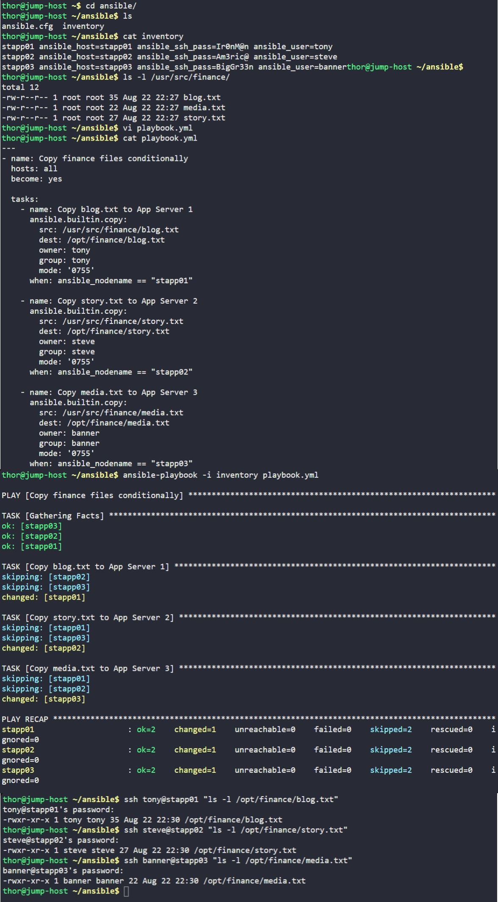

# Day 93: Using Ansible Conditionals


## Objective
The objective is to automate the distribution of specific financial data files to different application servers based on their hostnames. I developed a single playbook that targets the entire fleet but uses conditional logic to ensure each server receives only its designated file with the correct ownership and permissions.


**Gathering Facts**

When Ansible starts a play, the first thing it does is to gather facts. This is a discovery phase where Ansible collects a massive amount of data about the target server (OS version, IP addresses, CPU info, and the hostname). I utilized the **`ansible_nodename`** fact, which stores the specific server name (e.g., `stapp01`).

**The When Statement**

In a large infrastructure, I don't want to maintain 50 different playbooks for 50 different servers. Instead, I use **Conditionals** via the `when` keyword. When the playbook runs on all hosts, the condition checks the server's name. If the name matches the requirement (e.g., `when: ansible_nodename == "stapp01"`), the task goes through. If it doesn't match, the task is "Skipped."


## 1. Developed the Ansible Playbook
I created the `playbook.yml` file on the jump host. I used the `copy` module for the file transfers and attached `when` conditions to each task to filter the execution by node name.

```yaml
# /home/thor/ansible/playbook.yml
---
- name: Copy finance files conditionally
  hosts: all
  become: yes

  tasks:
    - name: Copy blog.txt to App Server 1
      ansible.builtin.copy:
        src: /usr/src/finance/blog.txt
        dest: /opt/finance/blog.txt
        owner: tony
        group: tony
        mode: '0755'
      when: ansible_nodename == "stapp01"

    - name: Copy story.txt to App Server 2
      ansible.builtin.copy:
        src: /usr/src/finance/story.txt
        dest: /opt/finance/story.txt
        owner: steve
        group: steve
        mode: '0755'
      when: ansible_nodename == "stapp02"

    - name: Copy media.txt to App Server 3
      ansible.builtin.copy:
        src: /usr/src/finance/media.txt
        dest: /opt/finance/media.txt
        owner: banner
        group: banner
        mode: '0755'
      when: ansible_nodename == "stapp03"
```

## 2. Execution and Verification
I executed the playbook using the provided inventory. I closely monitored the output to ensure the conditional logic was triggering correctly.

```bash
# Run the automation
ansible-playbook -i inventory playbook.yml

# Check the results on each server manually
ssh tony@stapp01 "ls -l /opt/finance/blog.txt"
ssh steve@stapp02 "ls -l /opt/finance/story.txt"
ssh banner@stapp03 "ls -l /opt/finance/media.txt"
```

## 3. Result
I verified the success through the playbook's "Recap" and manual checks:
*   **Task behavior:** When running the "Copy blog.txt" task, the output showed `skipping: [stapp02]` and `skipping: [stapp03]`, but `changed: [stapp01]`. This proves the logic worked perfectly.
*   **File Integrity:** Each server now has its correct file in `/opt/finance/`.
*   **Security:** All files are correctly owned by the respective server users (`tony`, `steve`, or `banner`) with the required `0755` permissions.

The infrastructure is now updated with server-specific data using a highly efficient, single-playbook approach.

## Screenshot
