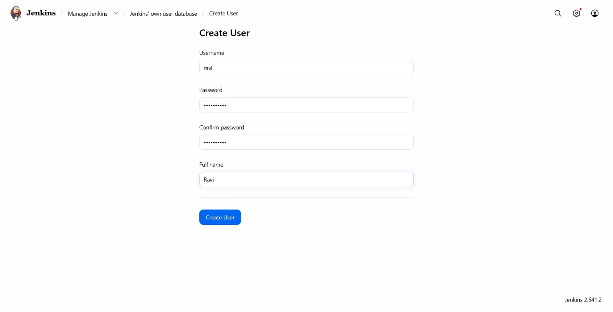
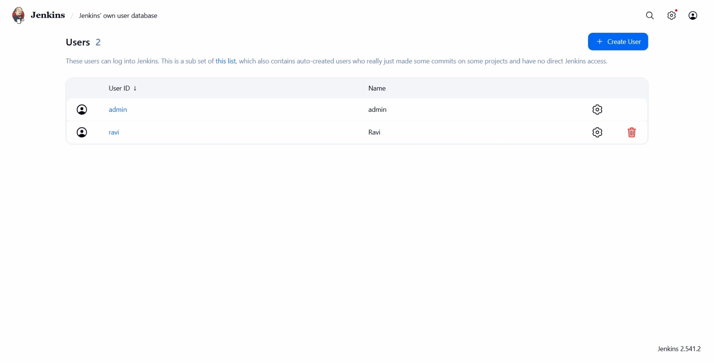
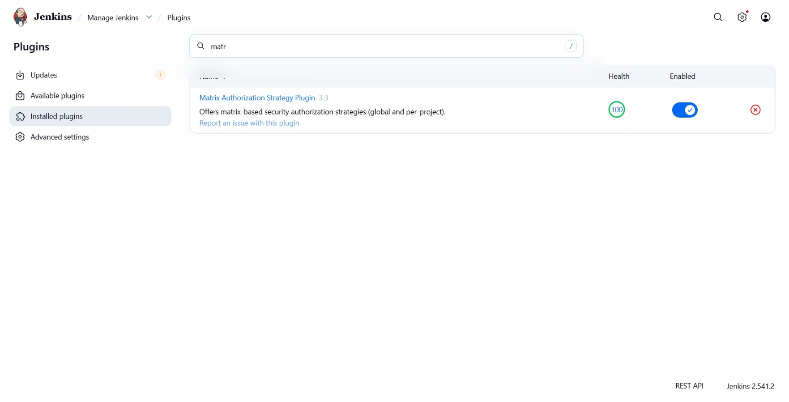
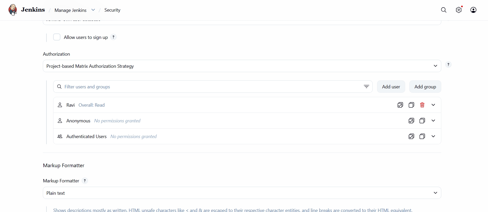
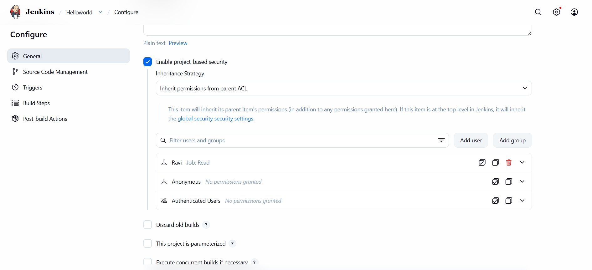
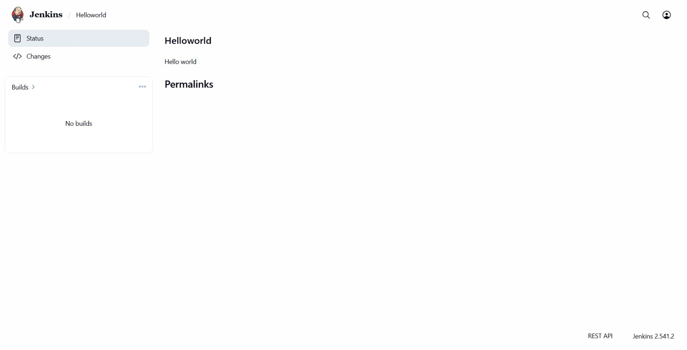

# Day 70: Configure Jenkins User Access

## Objective
The goal of this task is to implement **Role-Based Access Control (RBAC)** on the Jenkins server. I needed to create a new user for the development team and configure specific permissions so they can view jobs without having administrative rights or the ability to modify the server configuration.

## 1. Jenkins Authorization

**Security Realms vs. Authorization**
In Jenkins, there are two parts to security:
1.  **Security Realm (Who are you?):** This is the user database. I used Jenkins' own built-in database to create the user `ravi`.
2.  **Authorization (What can you do?):** This is where I define permissions.

**The Matrix Authorization Strategy**
Standard Jenkins security is "all or nothing." To get more control, I used the **Matrix Authorization Strategy** plugin.
*   **Global Matrix:** I defined what a user can do across the whole site (like just being able to log in and see the dashboard).
*   **Project-based Matrix:** This is a specific level of control. It allows me to go into a specific Job (like `Helloworld`) and say: Even though Ravi has global read access, he can only see this specific project and nothing else.

**Anonymous Access**
By default, some Jenkins setups allow "Anonymous" (unlogged-in) users to see jobs. A key part of hardening a production server is removing these permissions so that only authenticated users with a password can see company code.

## 2. Created the Development User
I logged into the Jenkins UI as `admin` and created the new user account with the requested credentials.

*   **Username:** `ravi`
*   **Password:** `B4zNgHA7Ya`
*   **Full Name:** `Ravi`

## 3. Installed Matrix Authorization Plugin
Because the default Jenkins install does not have granular "Matrix" settings, I had to install the necessary plugin.

*   Path: **Manage Jenkins** > **Plugins** > **Available plugins**
*   Plugin: **Matrix Authorization Strategy**

## 4. Configured Global Security
I enabled the **Project-based Matrix Authorization Strategy** under Global Security. This created a grid where I could check boxes for specific permissions.

**Steps I took:**
1.  Added the `ravi` user and gave them **Overall / Read**.
2.  Removed all checkboxes for the **Anonymous** user.

## 5. Configured Job-Level Permissions
To satisfy the requirement that Ravi should only have read permissions on the existing job, I navigated to the `Helloworld` project configuration.

**Settings applied:**
1.  Enabled **Enable project-based security**.
2.  Added user `ravi`.
3.  Checked **Job / Read**.
4.  Ensured all other boxes (Build, Configure, etc.) were unchecked for him.

## 6. Verification
I logged out as admin and logged back in as `ravi`. 

### Result
I verified that the user `ravi` can see the dashboard and the `Helloworld` job, but the "Manage Jenkins" options are hidden, and there are no "Build" or "Configure" buttons available on the job page.

