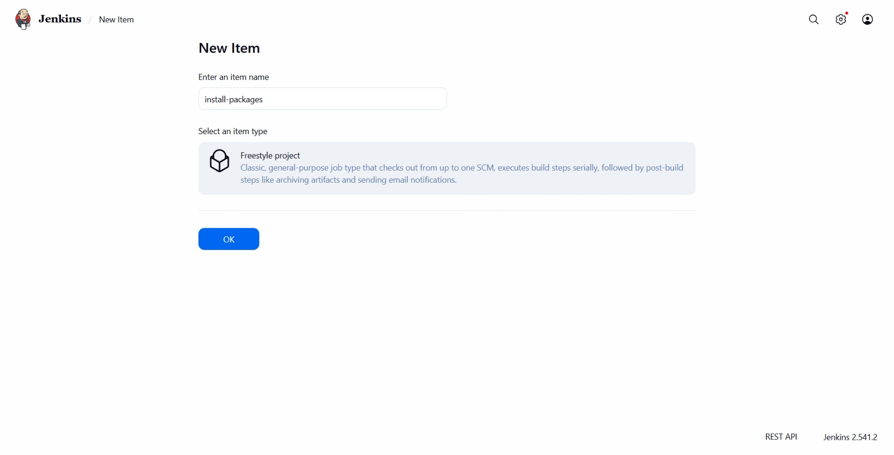
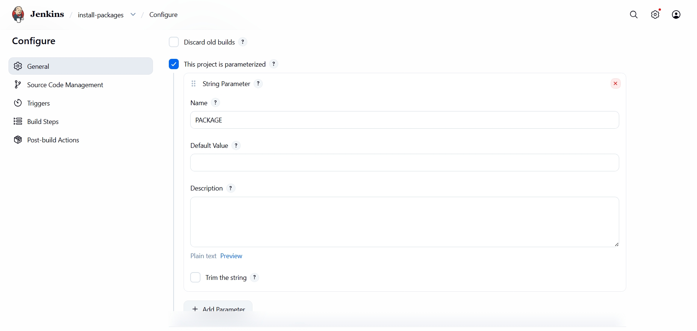
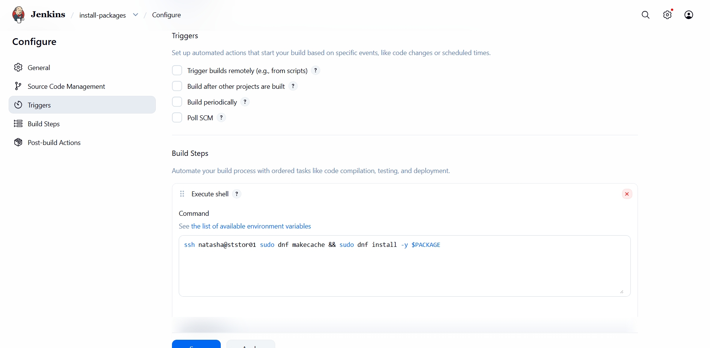
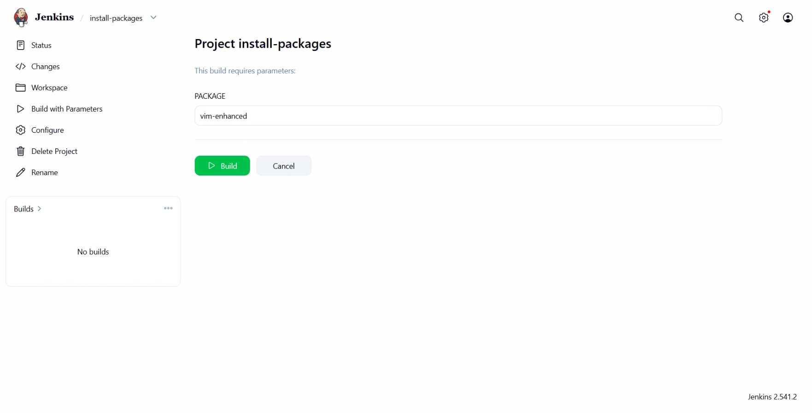
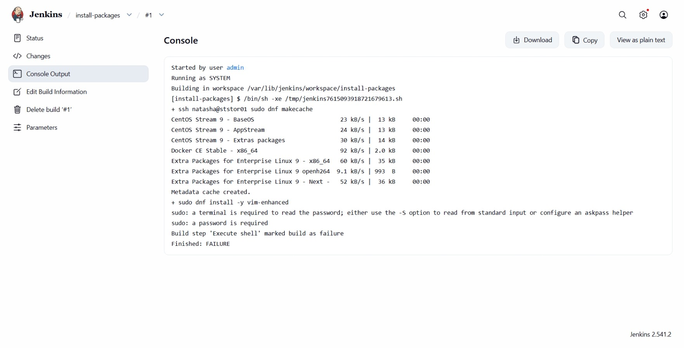
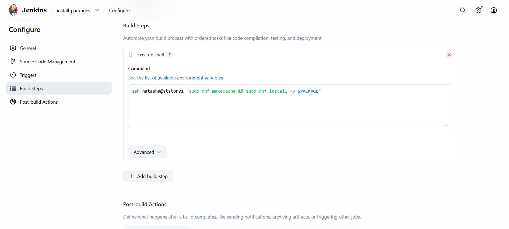
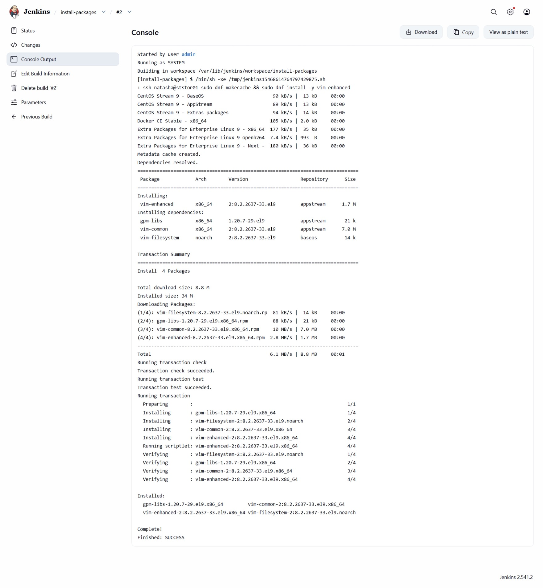
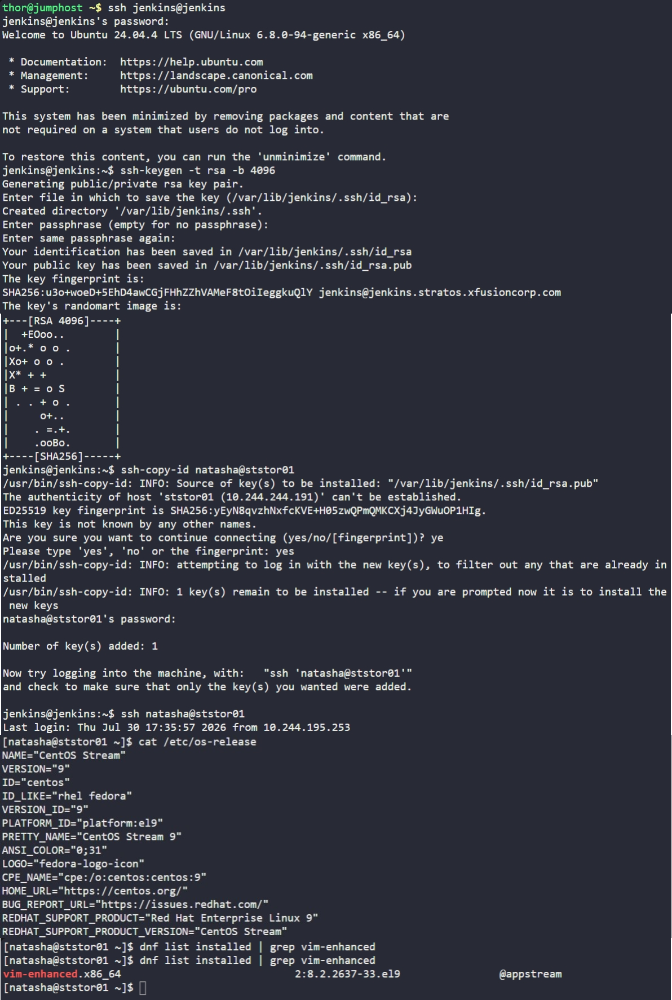

# Day 71: Configure Jenkins Job for Package Installation


## Objective
The objective is to automate the installation of software packages on the Storage Server (`ststor01`) using a parameterized Jenkins job. This ensures that the DevOps team can deploy required tools across the infrastructure consistently without manual intervention.


## 1. Parameterized Jobs and Passwordless SSH

A **Parameterized Job** is like a recipe where you can swap one ingredient at a time. Instead of creating a new job for every tool (Vim, Git, Nginx), I created one Installation Job that uses the `$PACKAGE` variable to execute the command.

**SSH and Automation**
When I run a command from the terminal, I can type a password when prompted. However, Jenkins is an automated service. To make this work, I had to set up **SSH Key-Based Authentication**. 
*   **The Key Pair:** I generated a ssh key pairs.
*   **The Handshake:** I placed the public key on the Storage Server. Now, when the Jenkins server connects, the Storage Server recognizes the Key and lets Jenkins in automatically without asking for a password.

## 2. Identified Target Environment
Before creating the job, I logged into the Storage Server to identify the Operating System. This determines whether I use `apt` (Ubuntu/Debian) or `dnf/yum` (CentOS/RHEL).

```bash
[natasha@ststor01 ~]$ cat /etc/os-release
# Result: CentOS Stream 9
```
**Conclusion:** I must use the `dnf` command for package management.


## 3. Configured Passwordless SSH
I logged into the Jenkins server as the `jenkins` user to set up the secure connection to the Storage Server.

```bash
# SSH into the Jenkins server
ssh jenkins@jenkins

# Generate the SSH key pair
ssh-keygen -t rsa -b 4096

# Copy the public key to the storage server
ssh-copy-id natasha@ststor01
```

I verified the connection by running `ssh natasha@ststor01`. Since it logged in without a password prompt, the automation bridge was ready.


## 4. Created the Parameterized Jenkins Job
I accessed the Jenkins Web UI and created a new job named `install-packages`.



**Step A: Added Parameter**
I checked the box "This project is parameterized" and added a **String Parameter**:
*   **Name:** `PACKAGE`



**Step B: Configured Build Step**
I added an "Execute shell" block with the following logic:

```bash
ssh natasha@ststor01 "sudo dnf makecache && sudo dnf install -y $PACKAGE"
```



I ran the build with the parameter `PACKAGE=vim-enhanced`.



## 5. Troubleshooting

My first build attempt failed with the error: `sudo: a terminal is required to read the password; either use the -S option...`.




I originally wrote the command without quotes: `ssh natasha@ststor01 sudo dnf makecache && sudo dnf install -y $PACKAGE`. 
Because of how the Linux shell works, only the `makecache` part was sent to the Storage Server. The `dnf install` part tried to run locally on the Jenkins server. Since the Jenkins server didn't have a sudo password configured for the automation user, the job crashed.

**Resolution:** I wrapped the commands in quotes `"..."` so that the `&&` logic happened on the Storage Server, not the Jenkins server.





## 6. Verification

I ran the build again with the parameter `PACKAGE=vim-enhanced`.

### Result
The Jenkins console showed `Finished: SUCCESS`. I verified the installation on the Storage Server:

```bash
[natasha@ststor01 ~]$ dnf list installed | grep vim-enhanced
vim-enhanced.x86_64  2:8.2.2637-33.el9  @appstream
```



The job is now fully operational and reliable for repeated executions.


## Screenshot
