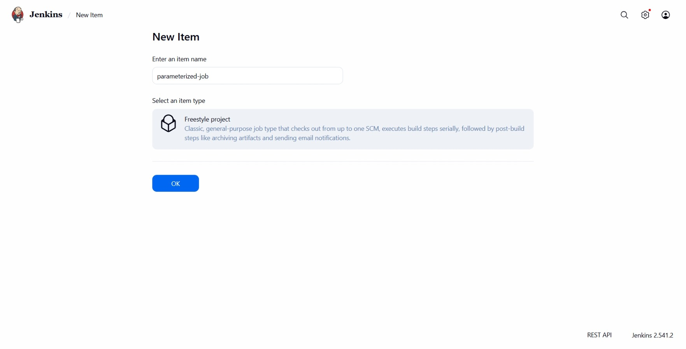
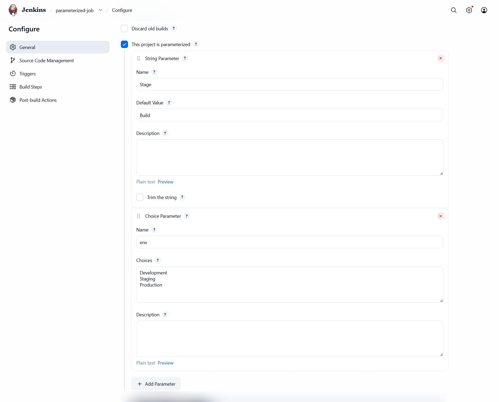
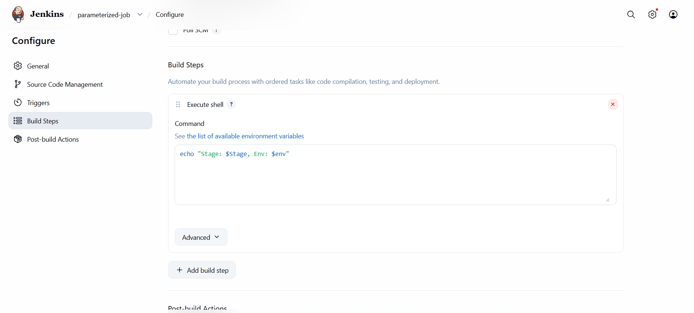
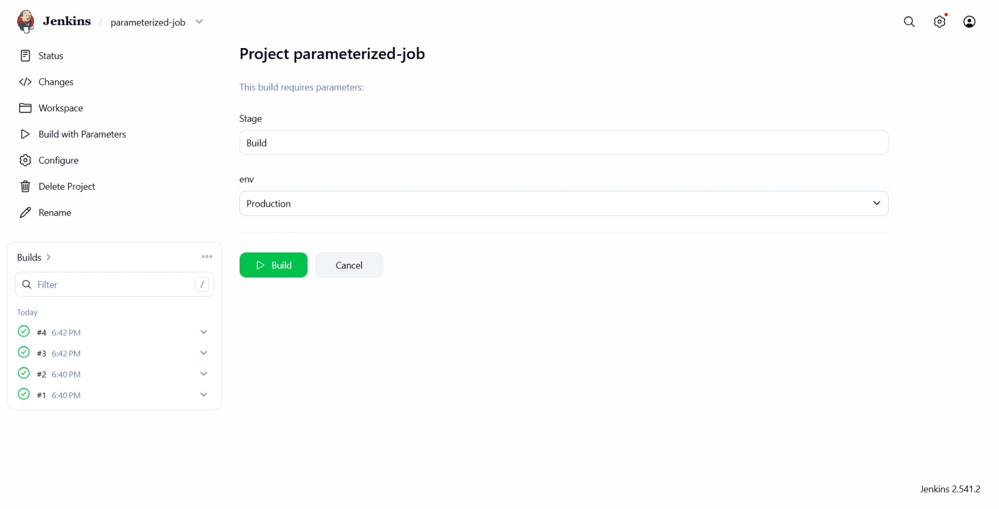
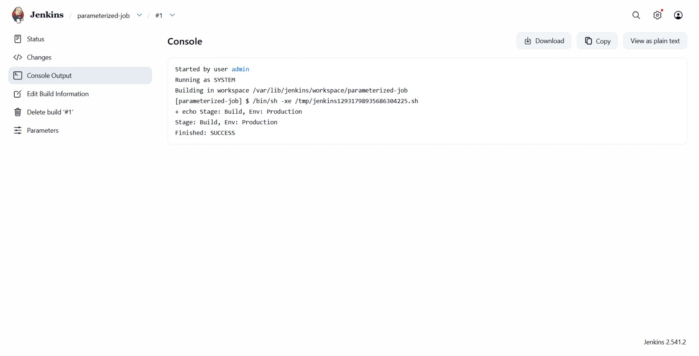

# Day 72: Jenkins Parameterized Builds


## Objective
The objective was to create a parameterized Jenkins job named `parameterized-job` to understand how runtime variables can be passed into automated builds. This allows a single job to handle different environments (like Development, Staging, or Production) dynamically.

## 1. Hardcoding vs. Dynamic Variables

By default, a Jenkins job executes the exact same steps every time it runs. However, real-world pipelines need flexibility—for example, deploying the same code to a "Staging" server versus a "Production" server. 

**How Parameters Work**
Instead of creating separate jobs for every scenario, a **Parameterized Job** exposes input fields when we click "Build with Parameters." 
*   **String Parameter:** Allows the user to type a custom value (with an optional default, like `Build`).
*   **Choice Parameter:** Provides a dropdown list of pre-defined options (like `Development`, `Staging`, `Production`) to prevent user input errors.
*   **Environment Injection:** Once the job runs, Jenkins converts these parameters into standard environment variables (e.g., `$Stage` or `$env`), which can be read directly inside shell scripts.

## 2. Created the Parameterized Job
I accessed the Jenkins Web UI, logged in with administrative credentials, and created a new **Freestyle project**.

*   **Item Name:** `parameterized-job`
*   **Project Type:** Freestyle project



## 3. Configured Parameters and Build Steps
In the job configuration page, I enabled **This project is parameterized** and added the required parameters and execution logic.




**Build Step (Execute Shell):**
I added a shell command to read both variables and print them to the console output:
```bash
echo "Stage: $Stage, Env: $env"
```




## 4. Triggered and Verified the Build
I navigated to the job page, clicked **Build with Parameters**, selected `Production` for the environment, and triggered the build.




### Result
I checked the **Console Output** of the completed build. The script successfully captured the runtime variables and printed the expected text:
```text
+ echo 'Stage: Build, Env: Production'
Stage: Build, Env: Production
Finished: SUCCESS
```
The parameterized job is now fully operational and ready to handle dynamic inputs.

