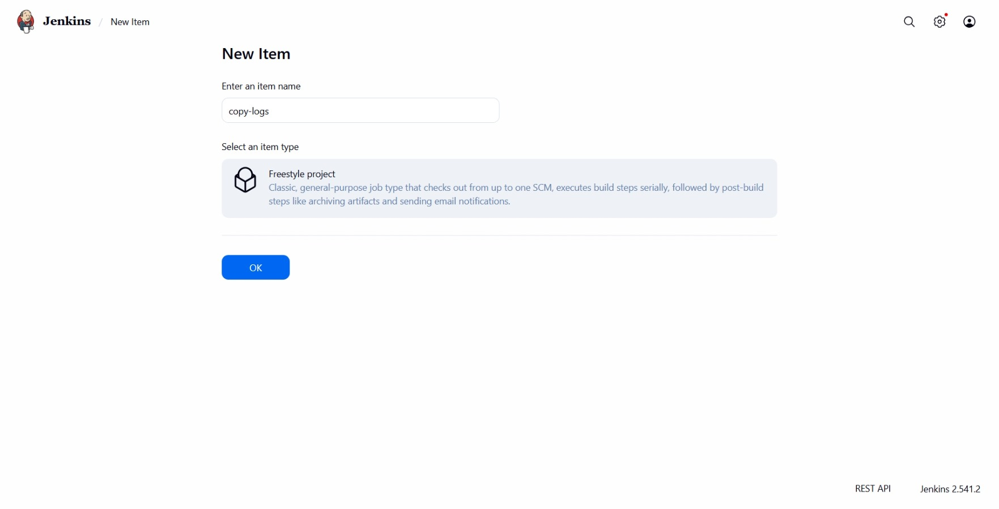
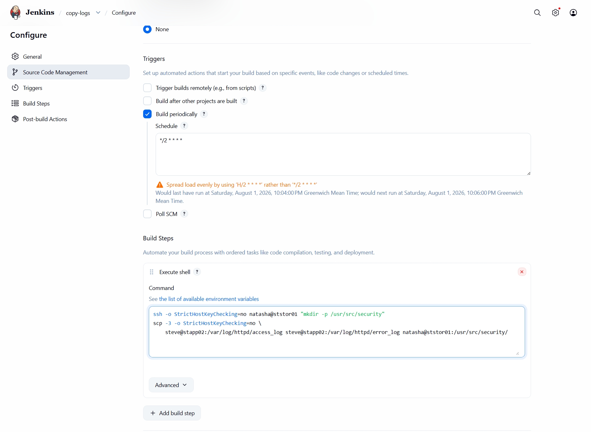
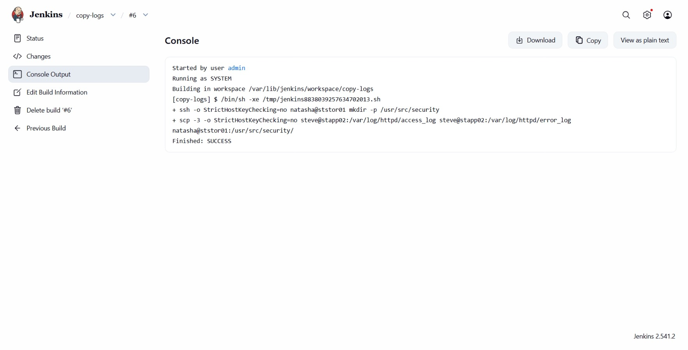
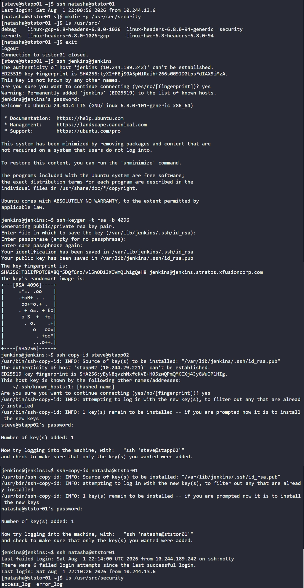

# Day 73: Jenkins Scheduled Jobs


## Objective
The objective was to automate the centralized collection of Apache logs from an application server to a secure storage server. I configured a Jenkins job to periodically fetch `access_log` and `error_log` from App Server 2 (`stapp02`) and archive them on the Storage Server (`ststor01`).

## 1. The Middleman Pattern (`scp -3`)

In a standard file transfer, Server A talks directly to Server B. This requires Server A to have the SSH keys for Server B for a passwordless connection. In a production environment with many servers, this creates an access problem or an inconvenience, where every server has keys to every other server, making security hard to manage.

I used the **`scp -3`** flag. In this model, the Jenkins server acts as a secure bridge:
1.  Jenkins connects to `stapp02` and pulls the log data into its own memory.
2.  Jenkins then immediately pushes that data to `ststor01`.
3.  **Result:** The App Server and Storage Server never communicate directly. Jenkins is the only one that needs the "keys" to both servers, centralizing security and keeping the infrastructure decoupled.

## 2. Configured Passwordless SSH
Before the job could run, I had to ensure the `jenkins` system user could access both remote hosts without being prompted for a password.

```bash
# Generated keys on Jenkins server
ssh-keygen -t rsa -b 4096 -N ""

# Distributed public keys to targets
ssh-copy-id steve@stapp02
ssh-copy-id natasha@ststor01
```

## 3. Created the Jenkins Job
I created a Freestyle project named `copy-logs` in the Jenkins Web UI.



**Step A: Configured Build Trigger (Cron)**
I set the job to run every 2 minutes using a cron expression.
*   **Schedule:** `*/2 * * * *`

**Step B: Configured Build Step (Execute Shell)**
I used a shell script to ensure the destination directory exists and then performed the routed transfer.

```bash
# Ensure the destination directory exists on the storage server
ssh -o StrictHostKeyChecking=no natasha@ststor01 "mkdir -p /usr/src/security"

# Execute the routed transfer (Middleman mode)
scp -3 -o StrictHostKeyChecking=no \
  steve@stapp02:/var/log/httpd/access_log \
  steve@stapp02:/var/log/httpd/error_log \
  natasha@ststor01:/usr/src/security/
```



## 4. Verification
I triggered a manual build to test the logic before letting the cron schedule take over.

**Jenkins Console Output:**
```text
+ ssh -o StrictHostKeyChecking=no natasha@ststor01 mkdir -p /usr/src/security
+ scp -3 -o StrictHostKeyChecking=no steve@stapp02:/var/log/httpd/access_log ...
Finished: SUCCESS
```



**Remote Verification:**
I logged into the Storage Server to confirm the files were successfully delivered.
```bash
ssh natasha@ststor01 "ls -la /usr/src/security/"
```

### Result
The logs are now being collected every 120 seconds. With this setup all credentials stay on the Jenkins server, and the application server remains isolated from the storage backend.

## Screenshot
