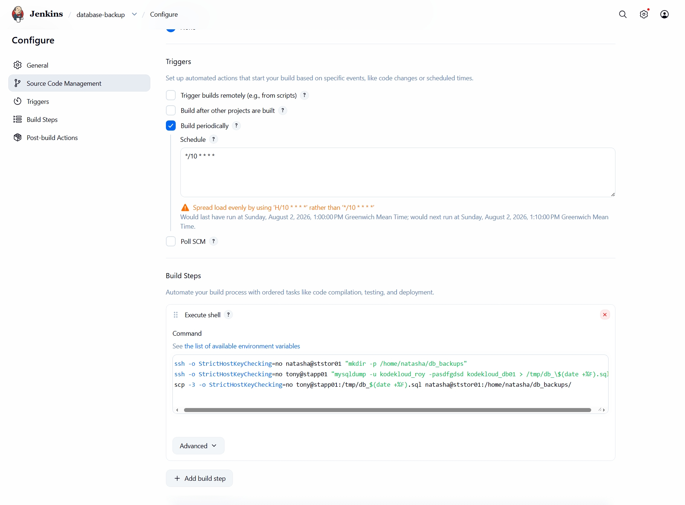
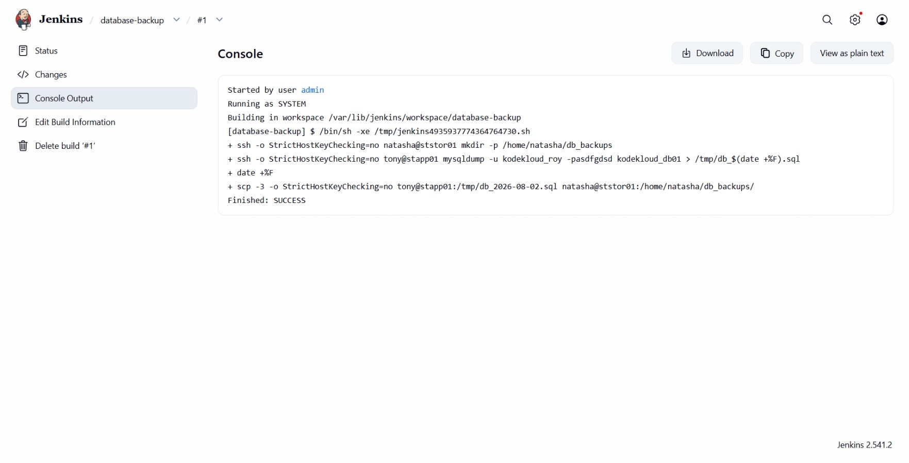
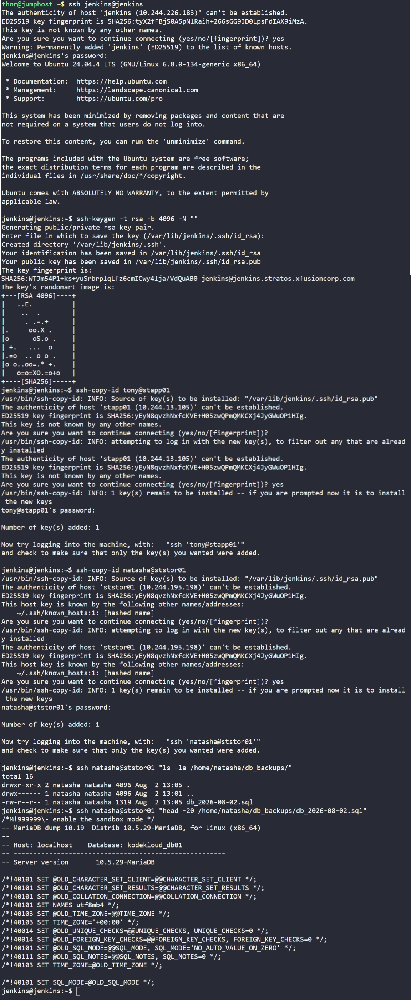

# Day 74: Jenkins Database Backup Job


## Objective
The objective is to automate the backup process for a MySQL database named `kodekloud_db01`. I configured a Jenkins job to remotely trigger a database dump on an application server and then transfer that backup to a central storage server for safekeeping, ensuring the job runs automatically every 10 minutes.

**Steps**
1. Jenkins SSHes into the App Server to create the backup file in a temporary folder (`/tmp`) using `mysqldump`.
2. Jenkins then uses `scp -3` to pull that file from the App Server and push it directly to the Storage Server.
3. **Security Model:** By doing this, the Application Server and the Storage Server never need to talk to each other directly. Jenkins holds all the keys, which reduces the "attack surface" of the infrastructure.

## 1. Setup Passwordless SSH

```bash
# Generated SSH keys for the jenkins user
ssh-keygen -t rsa -b 4096 -N ""

# Copied keys to the App Server and Storage Server
ssh-copy-id tony@stapp01
ssh-copy-id natasha@ststor01
```

## 2. Created the Jenkins Job

I created a Freestyle project named `database-backup` and configured the following:

**Step A: Configured Periodic Trigger (Cron)**
I set the job to run every 10 minutes using the requested cron expression.
*   **Schedule:** `*/10 * * * *`

**Step B: Configured Build Step (Execute Shell)**
I wrote a script to handle the directory creation, the database snapshot, and the file transfer.

```bash
# 1. Create the backup directory on the storage server if it doesn't exist
ssh -o StrictHostKeyChecking=no natasha@ststor01 "mkdir -p /home/natasha/db_backups"

# 2. Trigger the database dump on the App Server
# We name the file with a dynamic date tag (e.g., db_2026-08-02.sql)
ssh -o StrictHostKeyChecking=no tony@stapp01 "mysqldump -u kodekloud_roy -pasdfgdsd kodekloud_db01 > /tmp/db_\$(date +%F).sql"

# 3. Move the file from App Server to Storage Server via Jenkins bridge
scp -3 -o StrictHostKeyChecking=no \
  tony@stapp01:/tmp/db_\$(date +%F).sql \
  natasha@ststor01:/home/natasha/db_backups/
```



## 4. Verification
I ran a manual build to confirm the logic.

**Jenkins Console Output:**
```text
+ ssh -o StrictHostKeyChecking=no natasha@ststor01 mkdir -p /home/natasha/db_backups
+ ssh -o StrictHostKeyChecking=no tony@stapp01 mysqldump ...
+ scp -3 -o StrictHostKeyChecking=no tony@stapp01:/tmp/db_2026-08-02.sql ...
Finished: SUCCESS
```



**File Integrity Check:**
I logged into the Storage Server to ensure the file arrived and was not empty.
```bash
ssh natasha@ststor01 "ls -la /home/natasha/db_backups/"
ssh natasha@ststor01 "head -5 /home/natasha/db_backups/db_2026-08-02.sql"
```

### Result
The database is now being backed up automatically every 10 minutes. The backups are timestamped and stored on a remote server, fulfilling the requirements for a resilient data protection strategy.

## Screenshot
