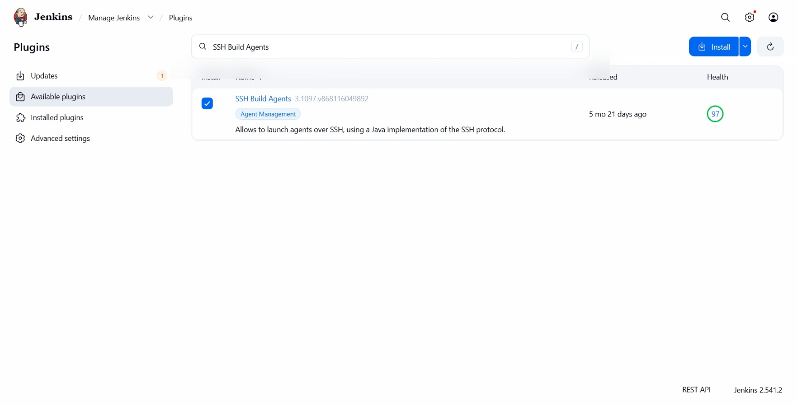
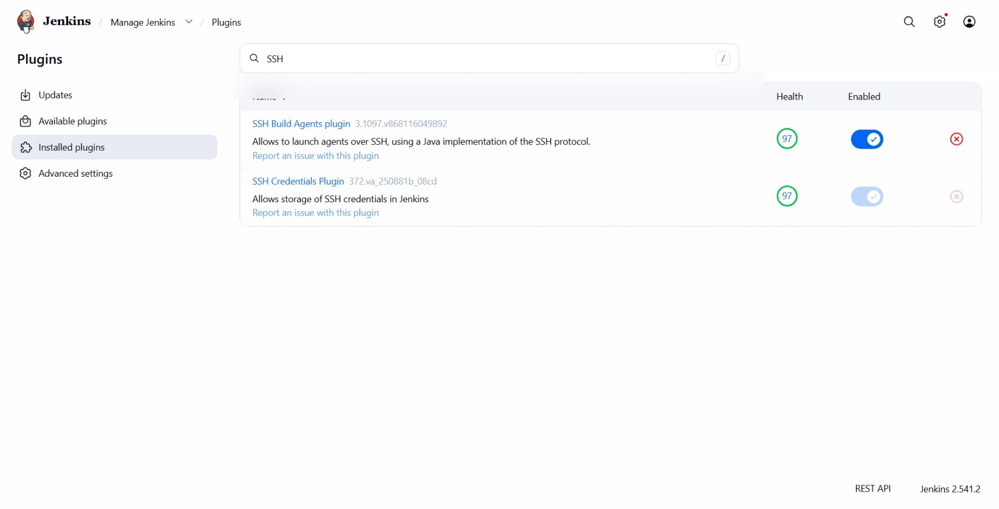
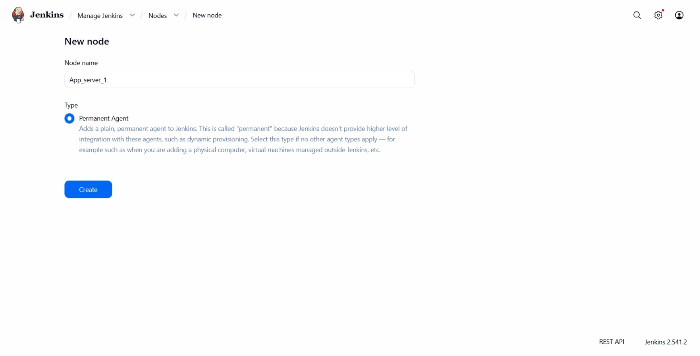
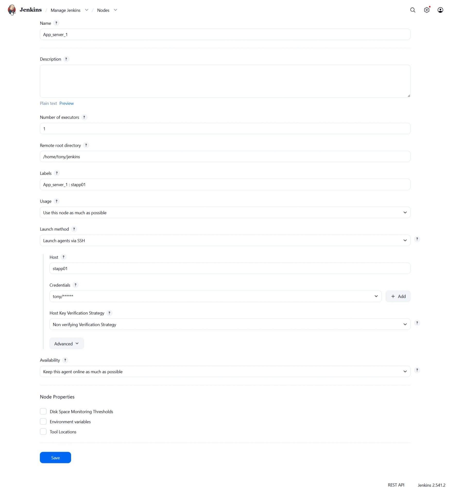
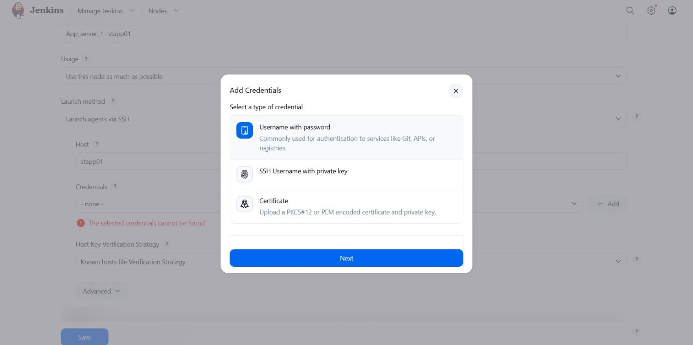
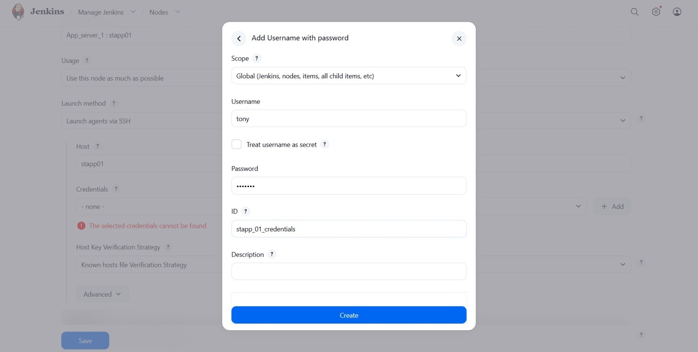
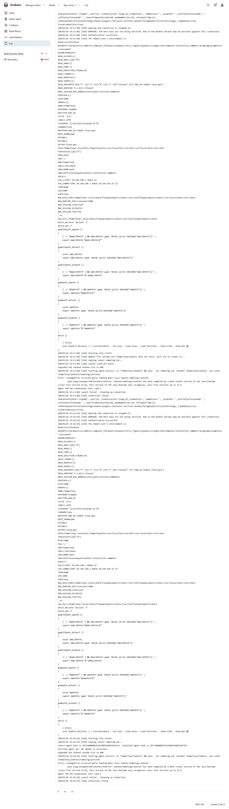
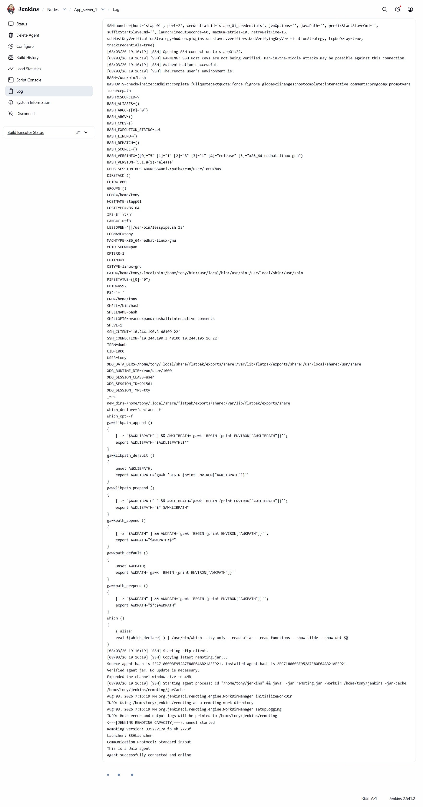
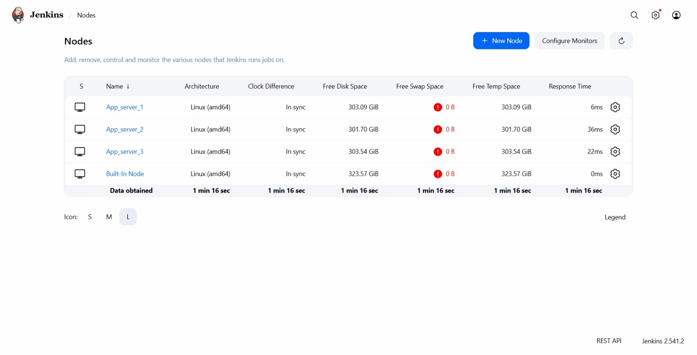
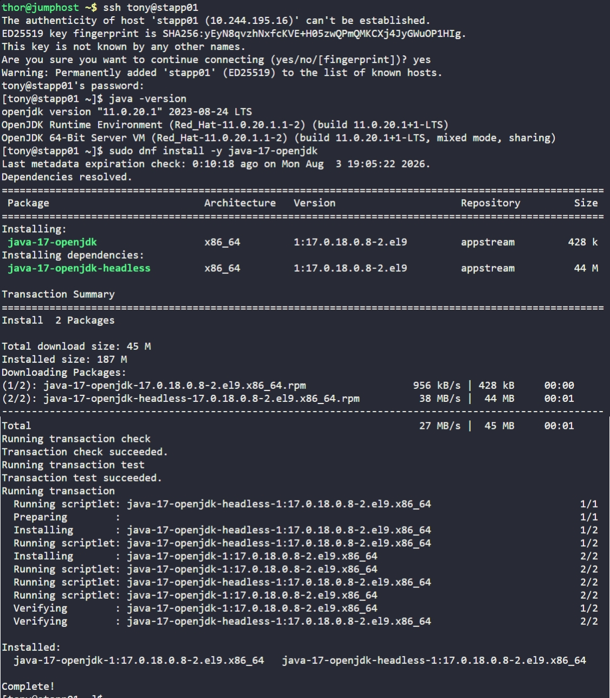

# Day 75: Jenkins Slave Nodes

## Objective
The objective is to expand the Jenkins infrastructure by adding all three application servers (`stapp01`, `stapp02`, and `stapp03`) as SSH build agents. This allows Jenkins to execute jobs directly on the target application servers, distributing the workload and enabling server-specific automation.

## 1. Jenkins Master-Agent

**The Orchestrator vs. The Workers**
We are transitioning from a standalone setup to a distributed setup. In this model, the main Jenkins server acts as the **Master**. It manages the UI, stores job configurations, and decides where tasks should run. The three application servers act as **Slave Nodes (Agents)**. They are the ones that do the actual work like compiling code or restarting services.

**Agent Communication (SSH)**
I used the **SSH Build Agents** plugin. When I launch an agent, the Jenkins Master opens a secure SSH connection to the target server. It then automatically uploads a small Java file called `remoting.jar`. This file starts a process that stays connected to the Master, waiting for instructions.

**Java Compatibility**
The `remoting.jar` file is a piece of software that requires a specific Java runtime to function. If the version of Java on the Slave Node is older than what the Master expects (e.g., Java 11 vs Java 17), the "Worker" cannot start its communication engine. This is why I had to ensure the underlying environment on every server was updated before the Master could take control.


## 2. Installed The required SSH Build Agents Plugin
I first started by installing the **SSH Build Agents** plugin that would be used to setup SSH connections between the master and the nodes.





## 2. Initial Node Configuration and Credential Creation
I started by attempting to add the first server through the Jenkins UI.

1.  I navigated to **Manage Jenkins > Nodes > New Node**.
2.  I created a Permanent Agent named `App_server_1`.
3.  Inside the configuration, I clicked **Add Credentials** to securely store the SSH login for the `tony` user.
4.  I set the **Remote root directory** to `/home/tony/jenkins` and the label to `stapp01`.
5.  I used the `Non verifying Verification Strategy` to allow the connection without manual SSH key management.







## 3. Troubleshooting
After saving the configuration, I attempted to launch the agent, but the connection failed. I inspected the **Agent Log** to find the root cause.



**The Issue:**
The log displayed a `java.lang.UnsupportedClassVersionError`. It stated the agent needed class file version `61.0` (Java 17), but the server only recognized up to `55.0` (Java 11).

**The Discovery:**
The Jenkins Master is running a modern version of the remoting engine that is incompatible with the default Java 11 found on the application servers.

**The Fix:**
I realized that if Server 1 failed, Servers 2 and 3 would have the same issue. I logged into all three servers via the terminal and upgraded the Java runtime to version 17.

```bash
# Executed on stapp01, stapp02, and stapp03
sudo dnf install -y java-17-openjdk
java -version # Verified version 17.0.18
```

## 4. Finalizing the Cluster Setup
With the Java environment corrected on all target hosts, I returned to the Jenkins UI to complete the worker pool.

1.  I relaunched `App_server_1`, and it successfully connected.
2.  I repeated the Node creation process for the remaining servers:
    *   **App_server_2:** Host `stapp02`, Root `/home/steve/jenkins`, Label `stapp02`, User `steve`.
    *   **App_server_3:** Host `stapp03`, Root `/home/banner/jenkins`, Label `stapp03`, User `banner`.



## 5. Verification
I checked the **Nodes** status page to confirm the health of the entire infrastructure.




### Result
I verified that `App_server_1`, `App_server_2`, and `App_server_3` all display a status of **Online**. Jenkins now has a full pool of three distributed workers ready to handle application-specific tasks in the Stratos Datacenter.

## Screenshot

