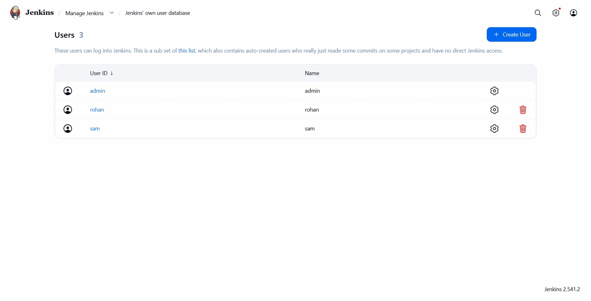
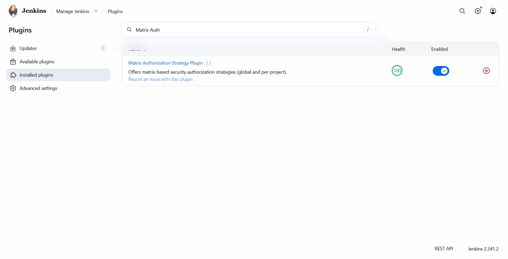
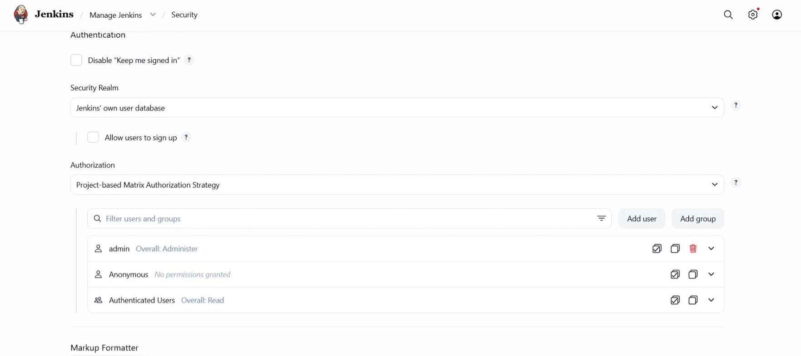
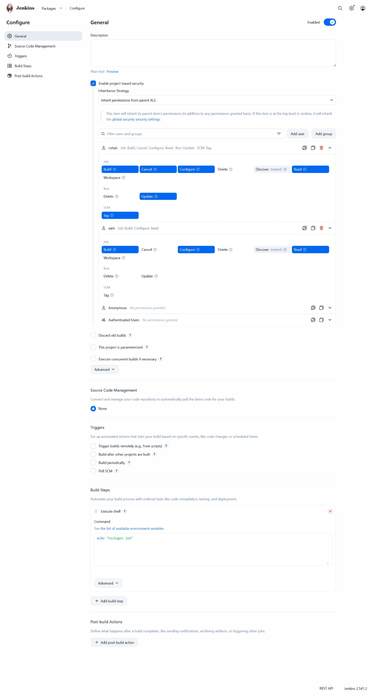
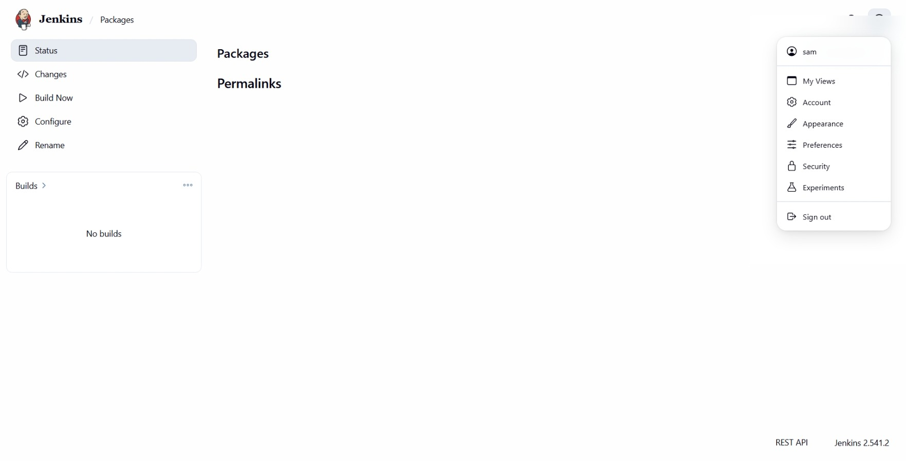
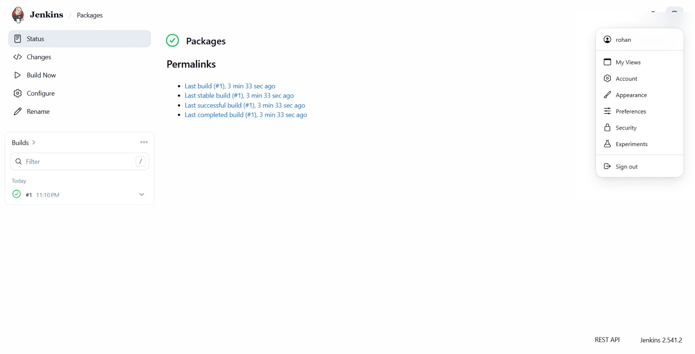

# Day 76: Jenkins Project Security

## Objective
The objective is to implement granular access control for two new developers, `sam` and `rohan`, on a specific Jenkins job named `Packages`. This ensures that each user has exactly the permissions required for their role without compromising the security of other system components.

## 1. Project-Based Matrix Authorization

In a professional Jenkins environment, security is managed through **Role-Based Access Control (RBAC)**. While global permissions determine what a user can see on the main dashboard, project-level permissions determine what they can do within a specific job.

**Inheritance Strategy (Parent ACL)**
I used the "Inherit permissions from parent ACL" strategy. This is a critical mental model: it means the job starts with the base permissions defined in the Global Security settings (like the ability to log in and see the dashboard) and then "layers" the specific job permissions on top. This keeps the configuration clean and ensures users don't lose basic access when job-specific rules are applied.

**The Permission Matrix**
Instead of simple "read/write" access, I utilized a matrix to assign specific actions. This allows for high-precision security:
*   **Build:** The right to trigger a job.
*   **Configure:** The right to change job settings.
*   **Read:** The right to see the job details and history.
*   **Update/Tag/Cancel:** Advanced management rights for controlling running builds and metadata.

## 2. Accessed Jenkins and Verified Users
I logged into the Jenkins UI as the `admin` user and verified that the users `sam` and `rohan` were already present in the system database.

I also Installed the **Matrix Authorization Strategy** plugin and made sure it's active.

I made sure to add the overall read permissions for authenticated users

## 3. Configured Job-Level Security
I navigated to the **Packages** job and clicked **Configure**. I scrolled to the **General** section to enable the security matrix for this specific project.

1.  I checked the box **Enable project-based security**.
2.  Under **Inheritance Strategy**, I selected **Inherit permissions from parent ACL**.
3.  I added both users to the matrix.

## 4. Applied User-Specific Permissions
I mapped the required permissions to each user by ticking the corresponding boxes in the matrix.

**For user `sam`:**
*   Job: **Build**
*   Job: **Configure**
*   Job: **Read**

**For user `rohan`:**
*   Job: **Build**
*   Job: **Cancel**
*   Job: **Configure**
*   Job: **Read**
*   Job: **Update**
*   Job: **Tag**

## 5. Verification
I performed a cross-login test to verify the access levels.

*   **Sam's View:** I logged in as `sam` and verified I could see the "Build Now" and "Configure" links, but options like "Tag" or "Cancel" were unavailable or restricted.

*   **Rohan's View:** I logged in as `rohan` and verified the presence of a broader set of management tools, including the ability to stop running builds and manage tags.

### Result
The `Packages` job is now securely accessible to the new developers with the exact level of authority requested by the development team. Global system settings remain untouched, maintaining the overall integrity of the Jenkins master.