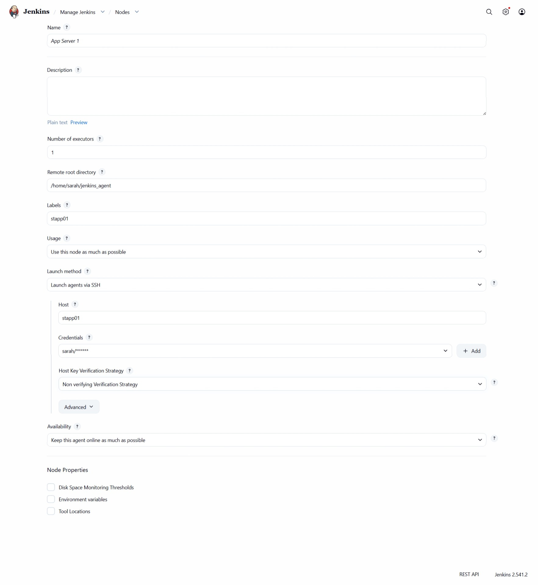
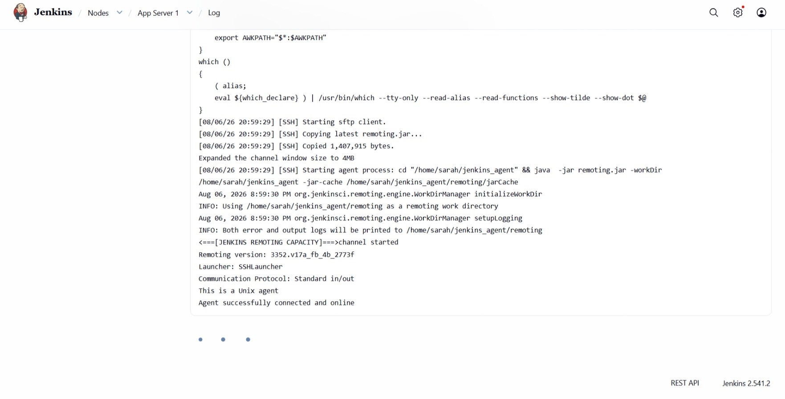
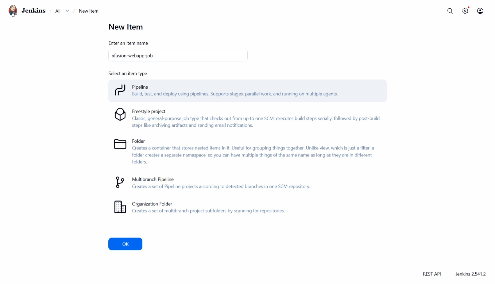
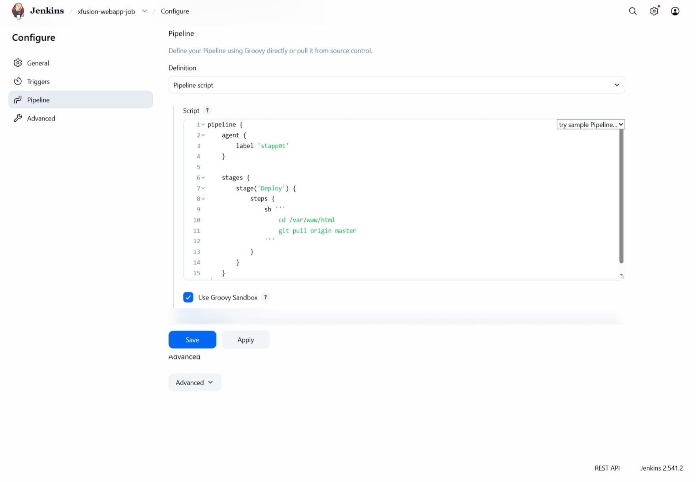
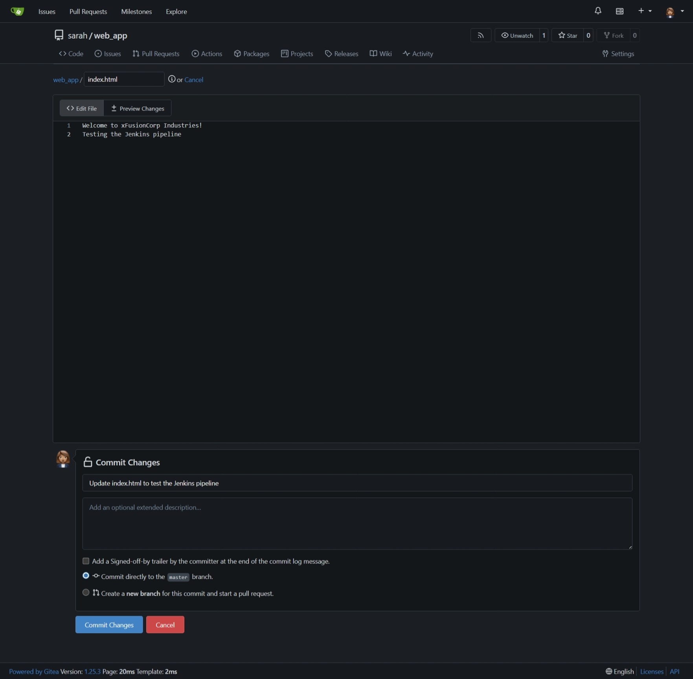
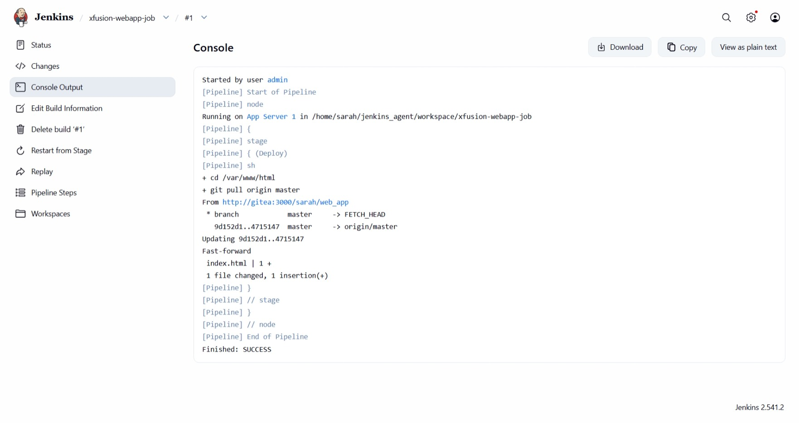
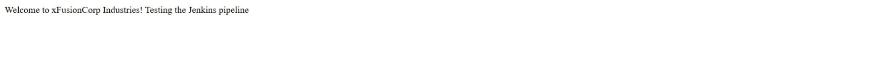
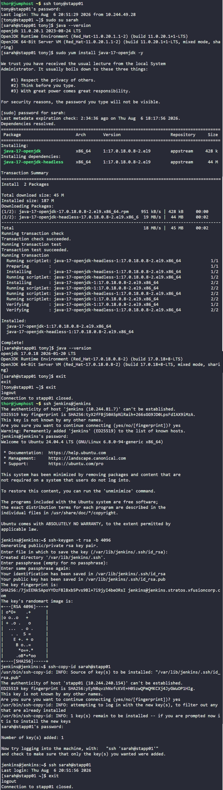

# Day 77: Jenkins Deploy Pipeline

## Objective
The objective is to automate the deployment of a static website from a Gitea repository to App Server 1 (`stapp01`) using a Jenkins Pipeline. I configured a distributed Jenkins environment where the deployment logic executes directly on the target web server via a dedicated SSH agent.

**The Distributed Agent (stapp01)**

I configured App Server 1 as a **Slave Node (Agent)**. 
- **The Sandbox:** The agent uses `/home/sarah/jenkins_agent` as its workspace to avoid cluttering the production web folder `/var/www/html`.
- **Java Compatibility:** Jenkins agents are Java-based. Since the agent software is compiled for modern environments, I had to upgrade the server from Java 11 to Java 17 for the connection to succeed.

**The Deployment Logic (Git Pull)**

Since the repository is already cloned under `/var/www/html` on the target server, the Deployment stage simply involves Apache serving files from that directory. By running `git pull`, I ensure that the server's local copy of the code matches the latest version pushed by the developer to Gitea.

**The Plugins:**

I installed the **SSH Build Agents** and **Pipeline** plugins to enable remote node connectivity and pipeline job functionality.


## 1. Prepared the Agent Environment
I logged into App Server 1 to upgrade Java and established copied the SSH keys from the Jenkins server into the App server 1 so automation could run without password prompts.

```bash
# On stapp01: Upgraded Java for Agent compatibility
sudo yum install -y java-17-openjdk

# On Jenkins Server: Generated SSH keys and distributed them to Sarah's account
ssh-keygen -t rsa -b 4096 -N ""
ssh-copy-id sarah@stapp01
```


## 2. Configured Jenkins Slave Node
I added the new node in the Jenkins UI to allow the master to delegate the deployment task.

- **Name:** `App Server 1`
- **Label:** `stapp01`
- **Remote Root Directory:** `/home/sarah/jenkins_agent`
- **Launch Method:** Launch agents via SSH (using Sarah's credentials)




I made sure the agent is running



## 4. Created the Jenkins Pipeline
I created a new Pipeline job named `xfusion-webapp-job`. I wrote a Groovy script to target the `stapp01` node and execute the deployment commands.

```groovy
pipeline {
    agent { label 'stapp01' }

    stages {
        stage('Deploy') {
            steps {
                sh '''
                cd /var/www/html
                git pull origin master
                '''
            }
        }
    }
}
```

**Key logic:**
- **`agent { label 'stapp01' }`**: Ensures this job only runs on App Server 1.
- **`stage('Deploy')`**: The mandatory, case-sensitive stage where the actual code update happens.







## 5. Verification
I created a commit modfying an html file in the repo before I triggered the pipeline and monitored the console output. Once the job finished with a "SUCCESS" status, I checked the application through the Load Balancer (LBR).







### Result
I verified that the website is accessible via the main URL. The `git pull` successfully synchronized the files in `/var/www/html`, and the server is now serving the latest content on port 8080, routed through the LBR, and the reflecting the changes made in the file.




## Screenshot
