# day 78: Jenkins Conditional Pipeline


## Objective
The objective is to create a dynamic Jenkins pipeline that deploys code to App Server 1 (`stapp01`) based on user input. I configured the pipeline to accept a `BRANCH` parameter, allowing me to conditionally deploy either the `master` or the `feature` branch to the web server's document root.


## Conditional Deployments

In previous tasks, my pipelines were static—they always pulled the same code. A **Conditional Pipeline** acts as a smart bridge. By adding a **String Parameter**, I have the option, If I type "master," Jenkins heads to the production code; if I type "feature," it heads to the development code.

**Distributed Environment**
By using a **Slave Node**, I ensure the Jenkins Master stays focused on management, while the actual heavy lifting (Git operations and file movement) happens directly on the target web server.


## Step-1: Log in to Jenkins UI and setup the pre-requisites.

I installed the **SSH Build Agents** and **Pipeline** plugins to enable remote node connectivity and scripted pipeline functionality.


## Step-2: Add the agent and setup the node such that it’s online.
Jenkins agents require a modern Java runtime. I logged into **stapp01** to upgrade the environment before connecting it to the Master.

```bash
# On stapp01: Upgraded Java to version 17
sudo yum install -y java-17-openjdk
java -version # Verified openjdk 17.0.18
```

I then created the node in the Jenkins UI with these details:
*   **Name:** `App Server 1`
*   **Label:** `stapp01`
*   **Remote Root Directory:** `/home/sarah/jenkins_agent`
*   **Credentials:** Added Sarah's SSH username and password.


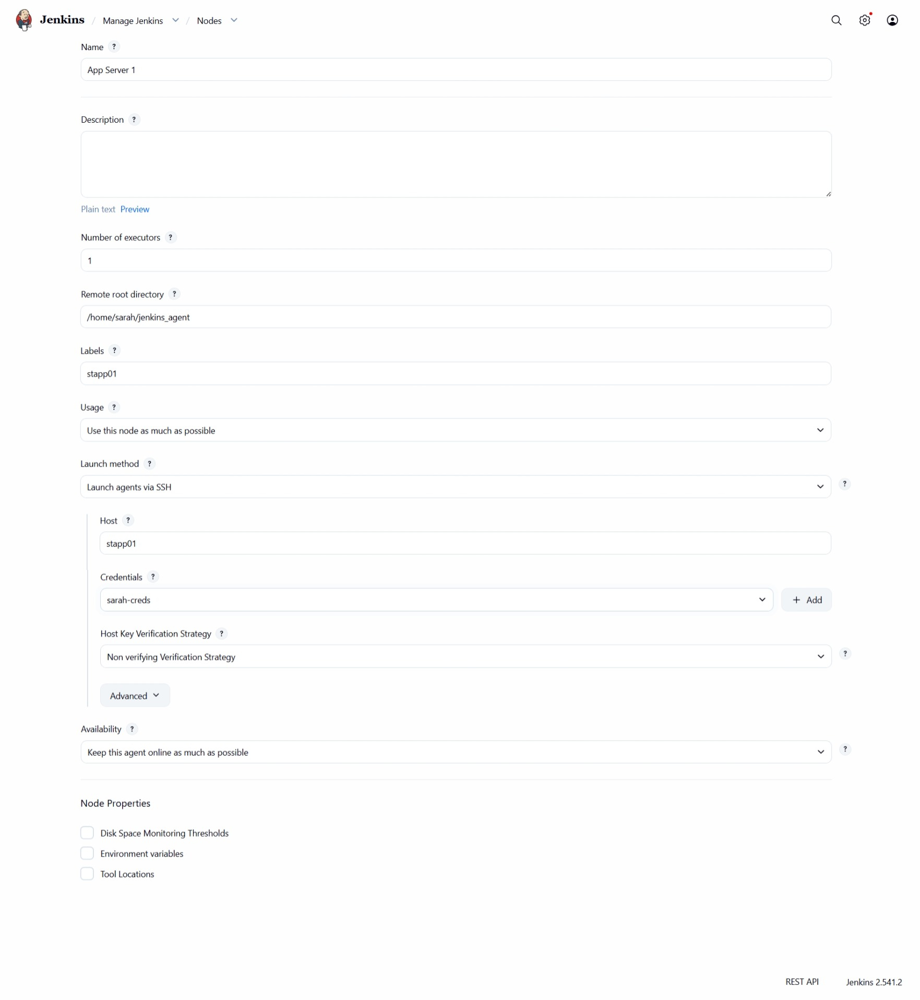

And made sure the node is running

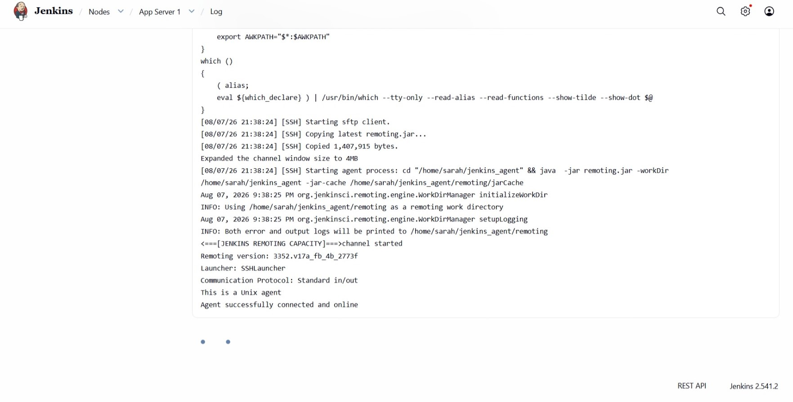


## Step-3: Create the pipeline job and configure it.
I created a new Pipeline job named `xfusion-webapp-job`. I enabled the "This project is parameterized" option and added a **String Parameter** named `BRANCH`.

I wrote the following Pipeline Script to handle the conditional logic:

```groovy
pipeline {
    agent { label 'stapp01' }

    parameters {
        string(
            name: 'BRANCH',
            defaultValue: 'master',
            description: 'Branch to deploy'
        )
    }

    stages {
        stage('Deploy') {
            steps {
                sh '''
                cd /var/www/html
                git fetch origin
                git checkout ${BRANCH}
                git pull origin ${BRANCH}
                '''
            }
        }
    }
}
```


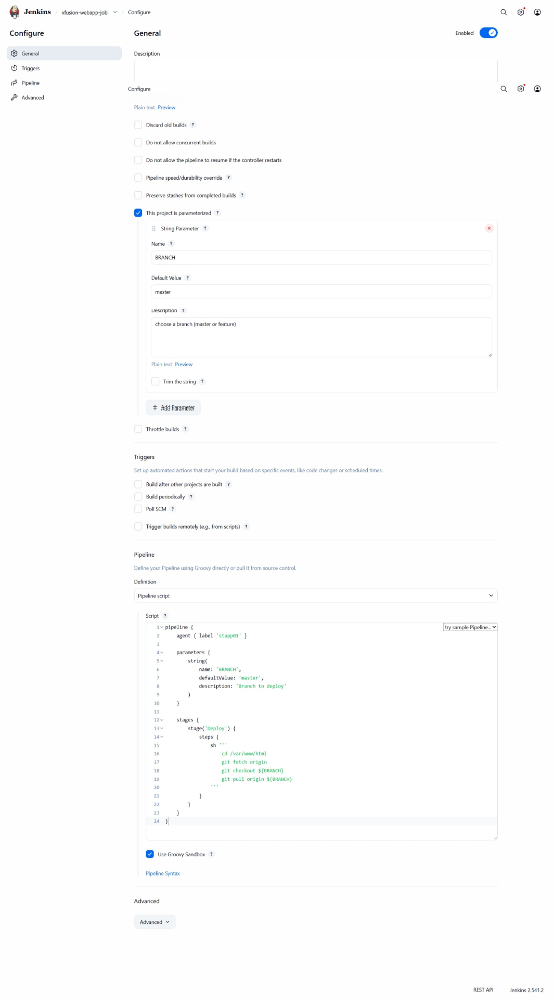


## Step-5: Setup Passwordless SSH connection.
I logged into the Jenkins server as the `jenkins` user and established a trust relationship with Sarah's account on the app server to ensure the `sh` steps in the pipeline could execute without a password prompt.

```bash
# On Jenkins server
ssh-keygen -t rsa -b 4096 -N ""
ssh-copy-id sarah@stapp01
```


## Step-6: Validate if job run is successful.
I performed three test scenarios to verify the requirements:

**Scenario 1: Deploy Master**
I modified the index HTML file in the repo branch master then On jenkins UI I clicked "Build with Parameters," entered `master`, and triggered the build.
*   **Result:** Jenkins switched the directory to the master branch. The App button showed the production content.

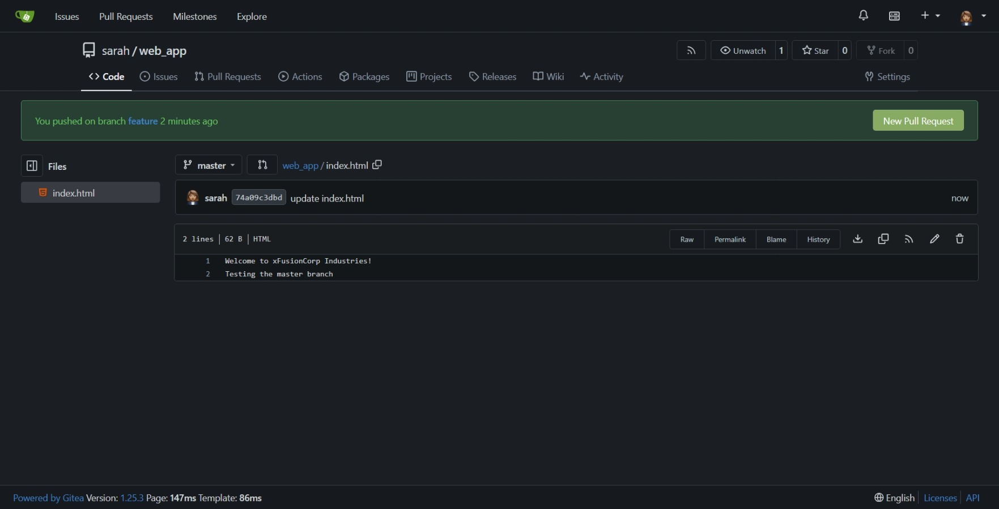

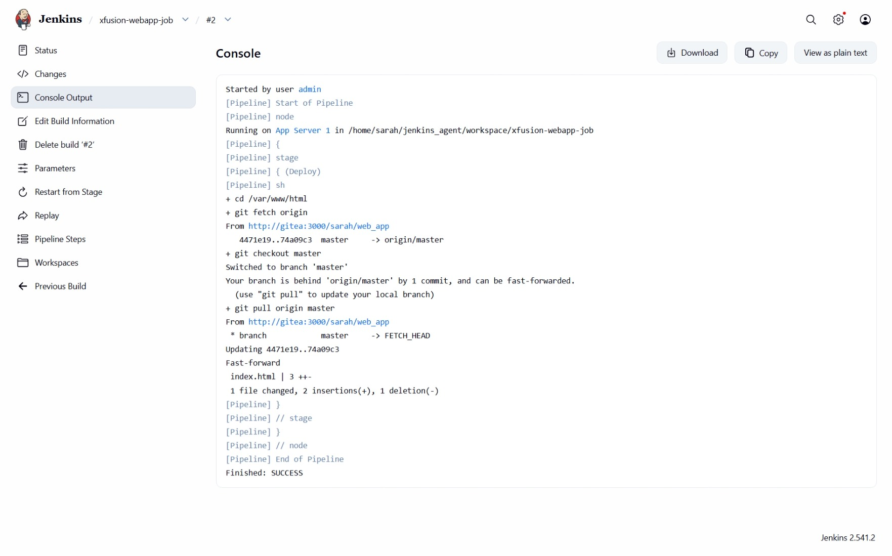


**Scenario 2: Deploy Feature**
I modified the index HTML file in the repo branch feature then On jenkins UI I triggered a build with the parameter `feature`.
*   **Result:** Jenkins switched the directory to the feature branch. The App button showed the "updated" development content.

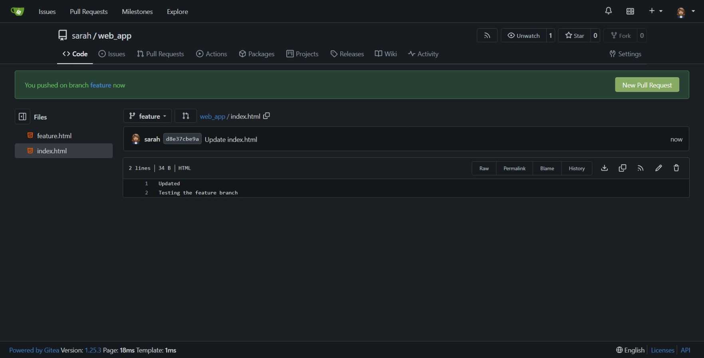
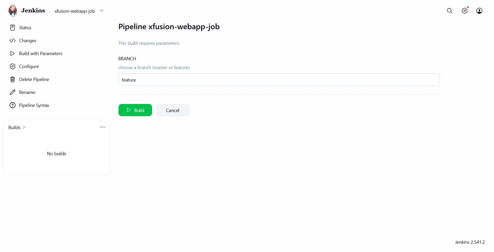
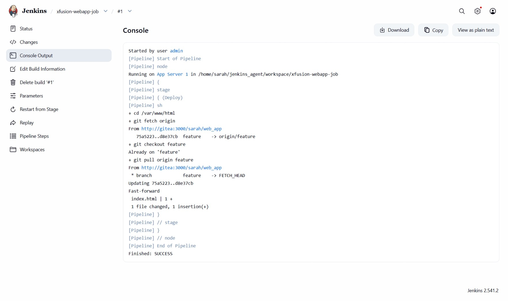
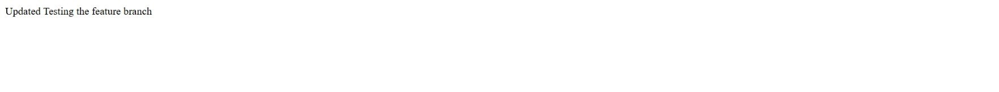


**Scenario 3: Negative Test**
I triggered a build with a non-existent branch name like `unknown`.
*   **Result:** The pipeline successfully failed during the `git checkout` step, preventing any accidental corruption of the web directory.

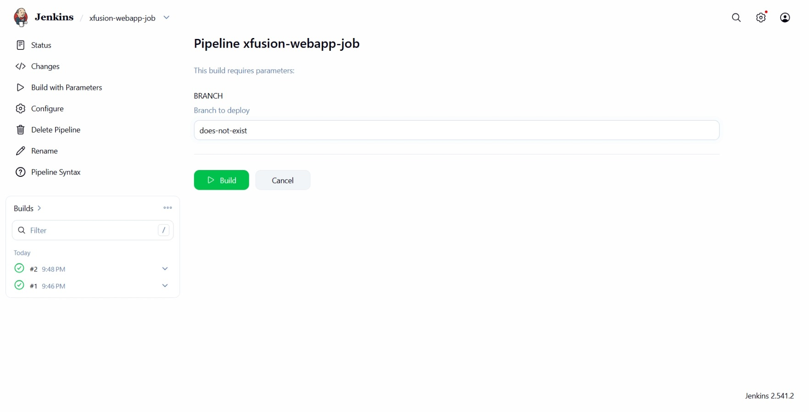
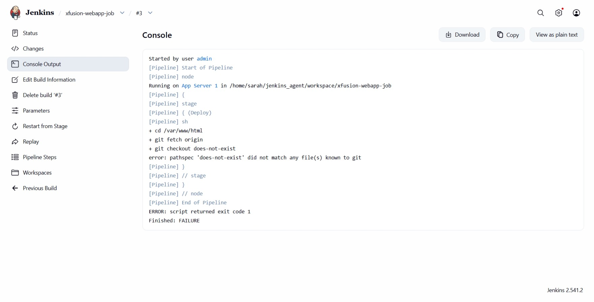


### Final Result
The conditional pipeline is fully operational. The DevOps team can now toggle between different versions of the website instantly via the Jenkins UI, satisfying the requirement for flexible environment management.

## Screenshot
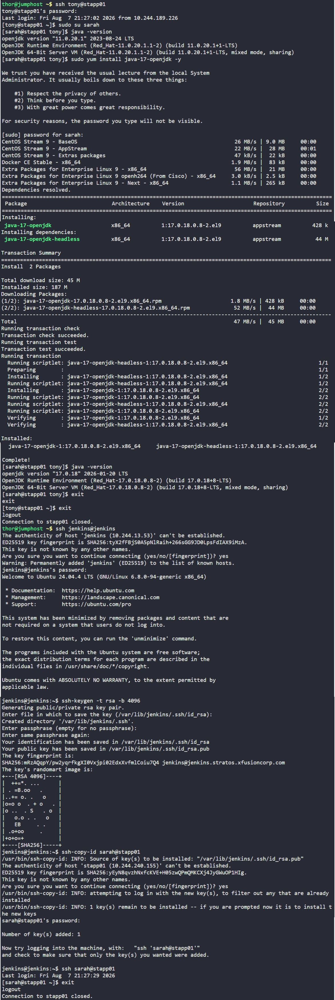