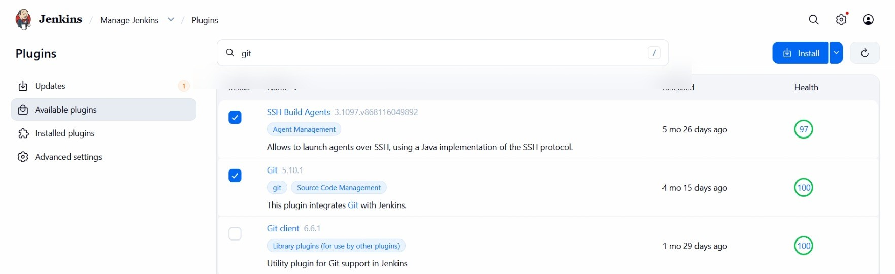
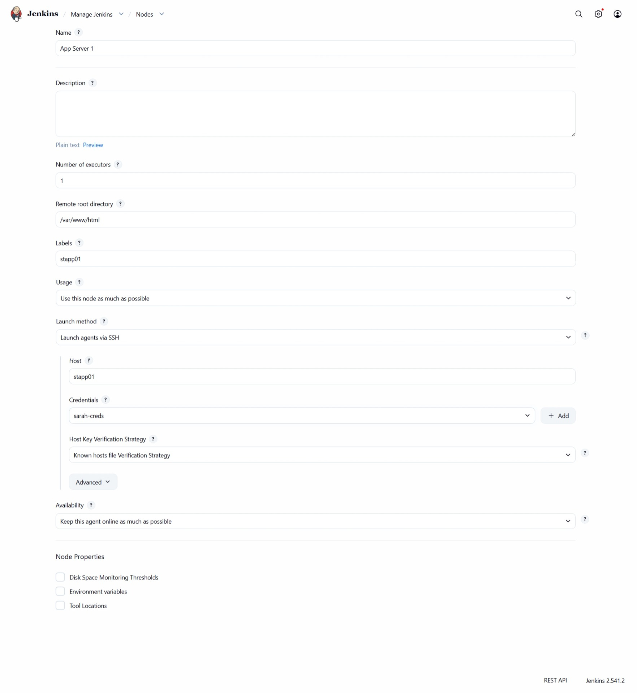
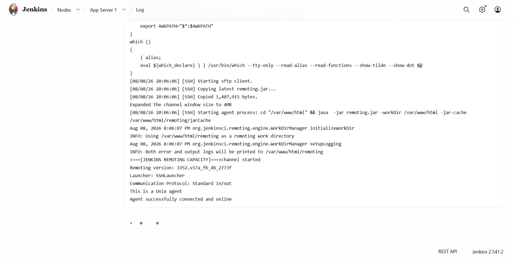
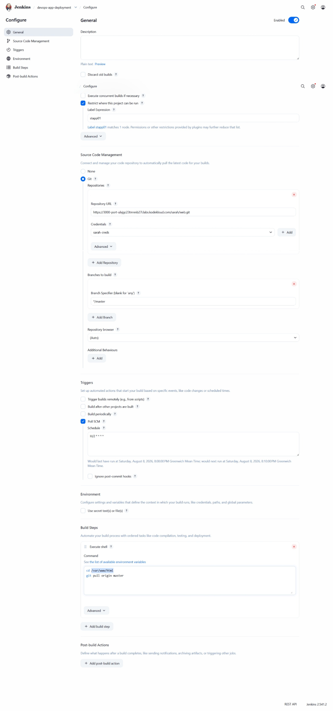
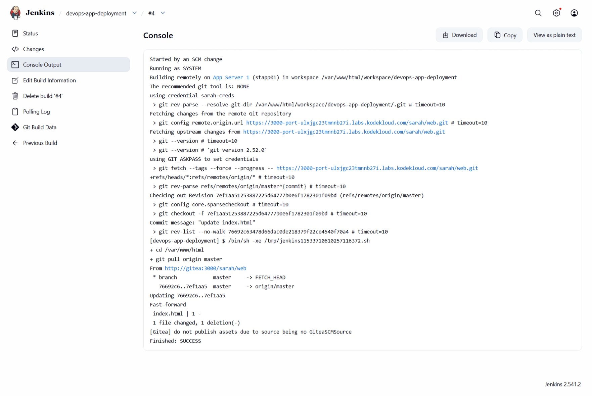
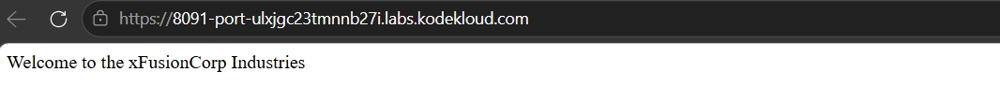
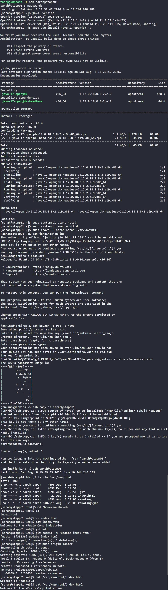

# Day 79: Jenkins Deployment Job


## Objective
The objective is to automate the deployment process for a web application on App Server 1 (`stapp01`). I configured a Jenkins job that monitors a Gitea repository for changes and automatically deploys the latest code to the Apache document root (`/var/www/html`) whenever a developer pushes to the master branch.

## 1. Continuous Deployment and Poll SCM

**Continuous Deployment (CD)**
Continuous Deployment is the practice of automatically releasing every code change that passes the automated testing phase to the production environment. Instead of a human manually moving files, Jenkins handles the synchronization between the source control (Gitea) and the web server.

**Poll SCM**
In a production environment, Jenkins needs to know when new code arrives. I used **Poll SCM** for this. Jenkins will be checking the Git server every 2 minutes to check if there is any new commits. If yes, it triggers the deployment job.

**Permissions and Document Roots**
Web servers usually serve files from a protected directory like `/var/www/html`. To allow Jenkins to deploy files there using a standard user account like `sarah`, I had to modify the directory ownership. This ensures that the automation agent has the necessary write permissions to update the website content.


I first Installed the required plugins:




## 2. Prepared the Environment on App Server 1
I logged into `stapp01` to prepare the system for the Jenkins agent and the deployment process.

```bash
# Upgraded Java to version 17 for agent compatibility
sudo yum install -y java-17-openjdk

# Changed ownership of the document root to the sarah user
sudo chown -R sarah:sarah /var/www/html

# Ensured Apache is running on port 8080
sudo systemctl start httpd
sudo systemctl enable httpd
```

## 3. Configured Jenkins Slave Node
I added `stapp01` as a permanent SSH agent in the Jenkins UI so that deployment tasks run directly on the web server.

*   **Name:** `App Server 1`
*   **Label:** `stapp01`
*   **Remote Root Directory:** `/var/www/html`
*   **Credentials:** Added `sarah`'s SSH credentials.





## 4. Created the Jenkins Deployment Job

I created a new Freestyle project named `devops-app-deployment`.

**Step A: Source Code Management**
I linked the job to the Gitea repository: `http://gitea:3000/sarah/web.git`.

**Step B: Configured Trigger**
I enabled **Poll SCM** with a schedule of `H/2 * * * *` to check for changes every two minutes.

**Step C: Build Environment**
I restricted the job to run only on the `stapp01` node using the label expression.

**Step D: Build Step (Execute Shell)**
I added the command to synchronize the live document root with the latest code.
```bash
cd /var/www/html
git pull origin master
```




## 5. Performed Developer Update

I logged into `stapp01` as the user `sarah` to simulate a developer workflow.

```bash
cd /home/sarah/web
# Updated index.html content
echo "Welcome to the xFusionCorp Industries" > index.html

# Pushed changes to origin
git add index.html
git commit -m "Update index.html"
git push origin master
```

## 6. Verification
I monitored the Jenkins dashboard and verified that the build was triggered automatically by the SCM poll.




### Result
I checked the application through the Load Balancer URL. The page successfully loaded with the updated text: `Welcome to the xFusionCorp Industries`. The automation is now fully functional, ensuring that the live website always reflects the latest code in the master branch.




## Screenshot
