# Day 80: Jenkins Chained Builds

## Objective
The objective is to implement a multi-stage automation workflow known as "Chained Builds." I configured an upstream deployment job to pull the latest code and a downstream management job to restart the web service only if the deployment succeeds. This ensures that the application service is never restarted if the code update fails, maintaining environment stability.

## Upstream and Downstream

In complex automation, I don't want a single massive script that does everything. Instead, I use a Chain Reaction model:

**The Upstream Job (The Trigger)**

In this task, `xfusion-app-deployment` is the upstream job. Its only responsibility is to interact with Git and update the files on the server. It doesn't care about the web server service itself; it only cares about the code.

**The Downstream Job (The Follower)**

This is the second link. `manage-services` is the downstream job. It is "watching" the upstream job. It only runs if the upstream job finishes with a **Stable** (success) status. If a developer pushes bad code and the Git pull fails, this job stays dormant, preventing a restart of a broken application.

**Separation of Concerns**

By splitting "Deployment" and "Service Management" into two jobs, I make the pipeline easier to troubleshoot. If the website doesn't update, I look at Job A. If the service fails to restart, I look at Job B. This modularity is a core principle of professional CI/CD design.


## 2. Prepared the Slave Node

I first installed the required plugins:

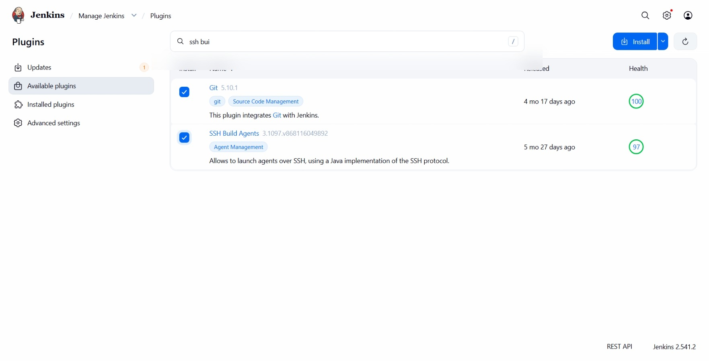

Then I configured App Server 1 (`stapp01`) as a Jenkins agent to ensure the commands execute directly where the web server lives.

```bash
# On stapp01: Upgraded Java to version 17 for agent compatibility
sudo yum install -y java-17-openjdk

# Verified Java version
java -version
```

I then added the node in Jenkins:
*   **Name:** `App Server 1`
*   **Label:** `stapp01`
*   **Remote Root:** `/var/www/html`
*   **Credentials:** `tony` user credentials.


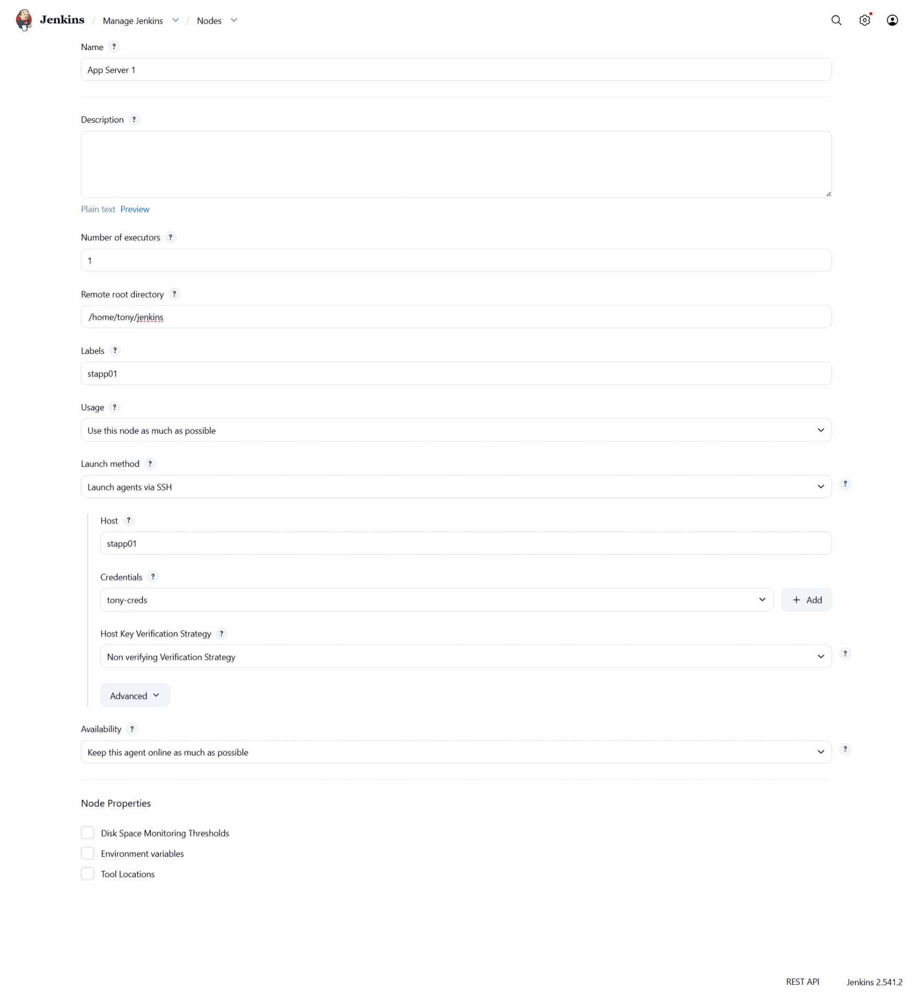


And made sure the node is running

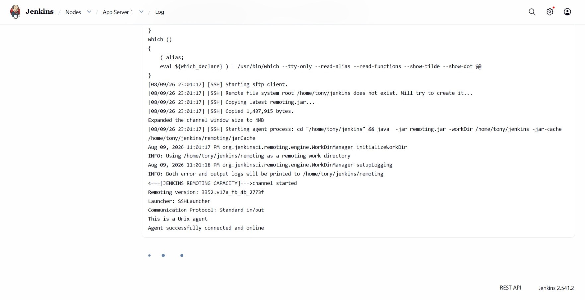


## 3. Created the Upstream Job (xfusion-app-deployment)
I created a Freestyle project to handle the code synchronization. I restricted the job to run on the `stapp01` label.

**Build Step (Execute Shell):**
```bash
# Mark the directory as safe for the automation user (owned by another user sarah)
sudo git config --global --add safe.directory /var/www/html

# Pull latest changes from Gitea
cd /var/www/html
sudo git pull origin master
```

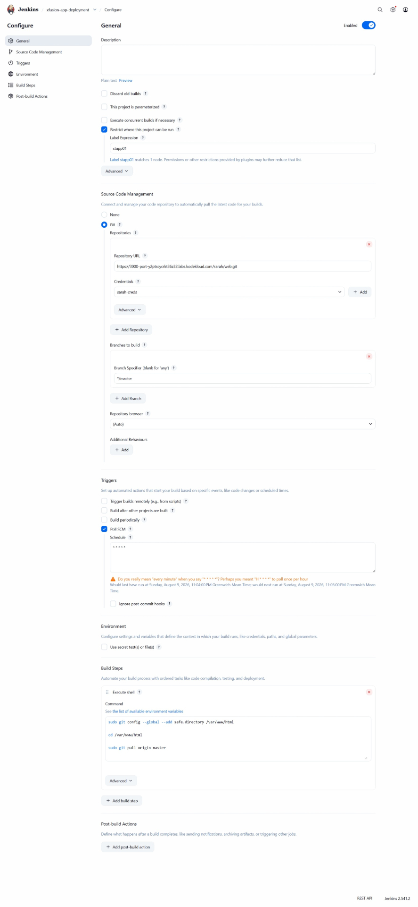


## 4. Created the Downstream Job (manage-services)
I created a second Freestyle project specifically for service maintenance, also restricted to the `stapp01` label.

**Build Step (Execute Shell):**
```bash
# Restart the Apache service to apply changes
sudo systemctl restart httpd
```


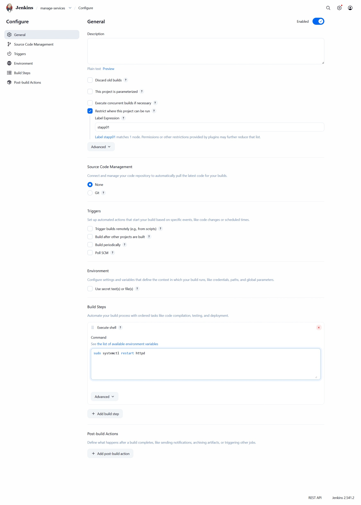


**Build Trigger:**
I then went back to the `xfusion-app-deployment` job and added a post build action and entered `manage-services` in the "Projects to build" field. I selected the option **Trigger only if build is stable** that way the **manage-services** will get riggered only when the the **xfusion-app-deployment** job is successful.

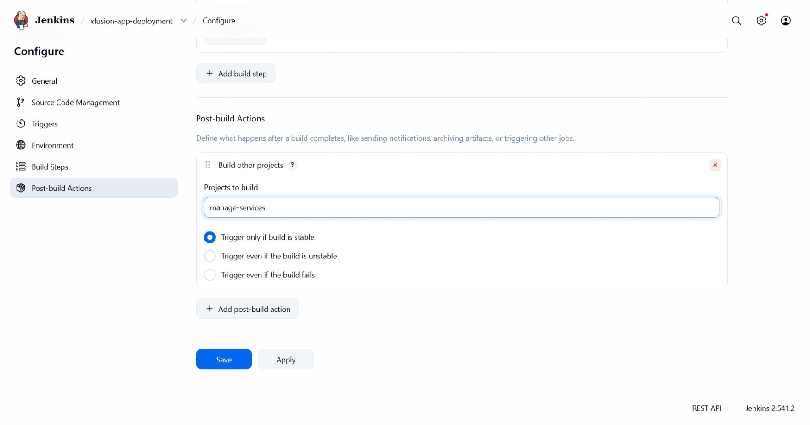


## 5. Verification
I triggered the upstream job `xfusion-app-deployment` manually to test the chain.

**Jenkins Dashboard Observation:**
1.  `xfusion-app-deployment` started and finished with a green checkmark.
2.  Immediately after, `manage-services` was automatically added to the build queue.
3.  `manage-services` finished successfully.


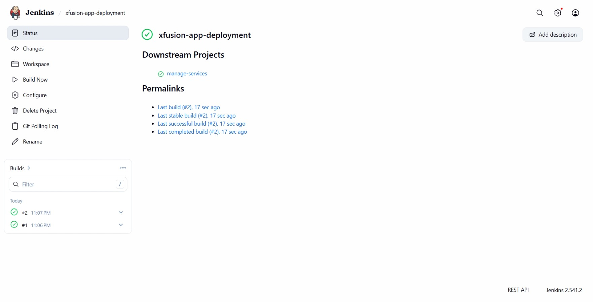
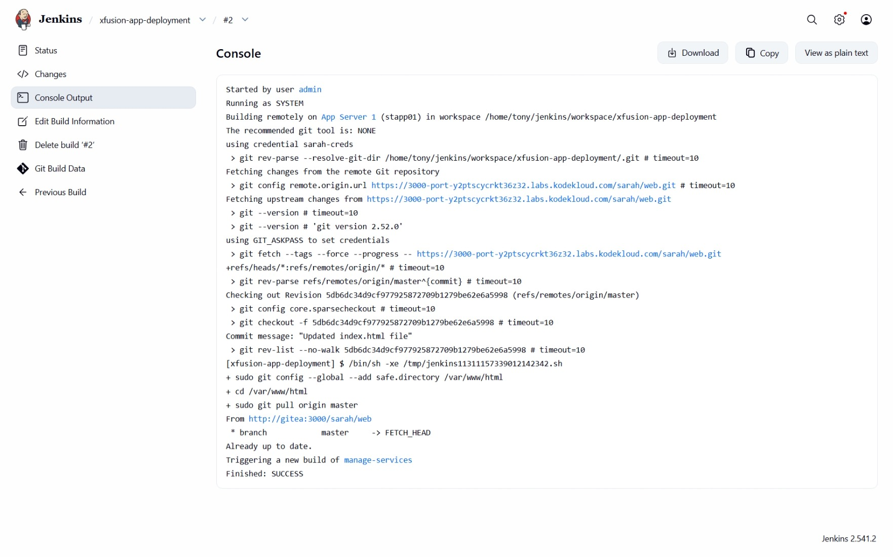


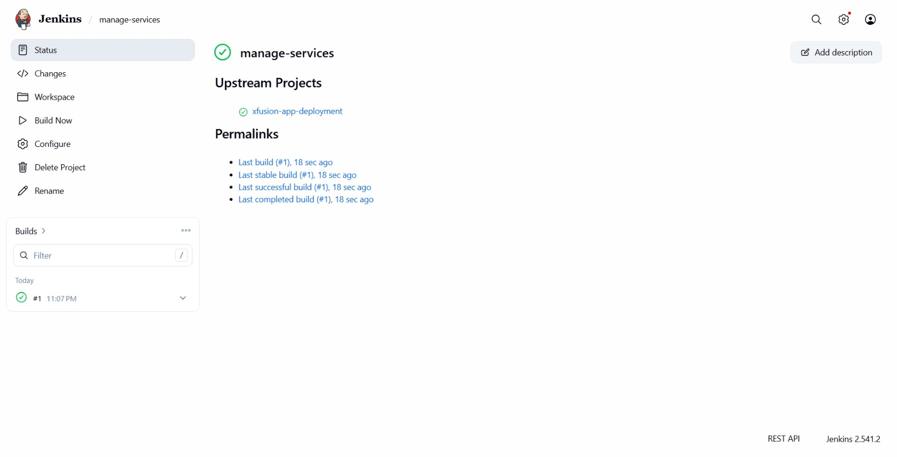
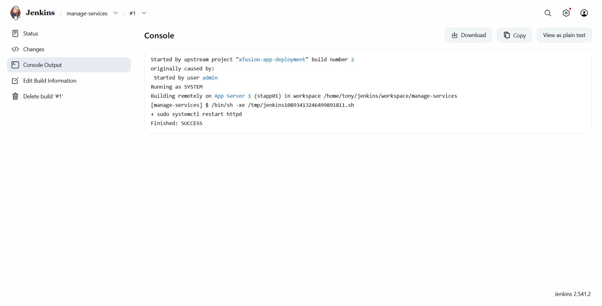


**LBR Verification:**
I clicked the **App** button and verified the website loaded correctly through the load balancer.

### Result
The chained build is successful. I have established a safe, two-step automation pipeline where the service restart is strictly dependent on a successful code deployment.

## Screenshot
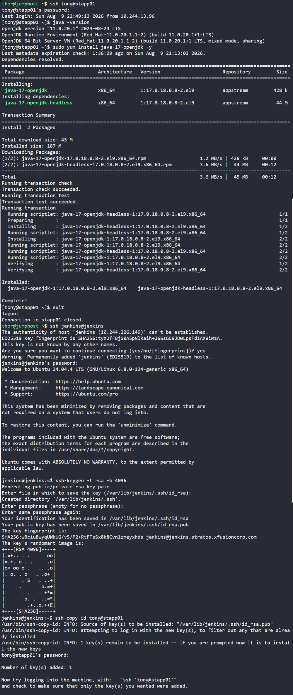