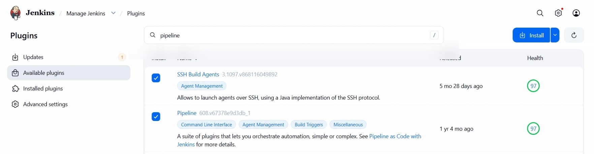
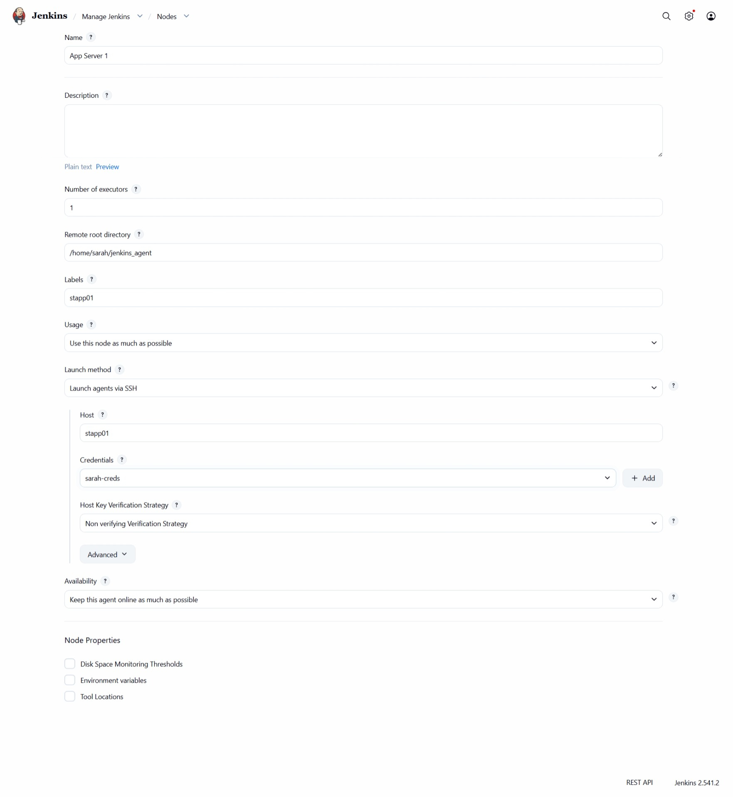
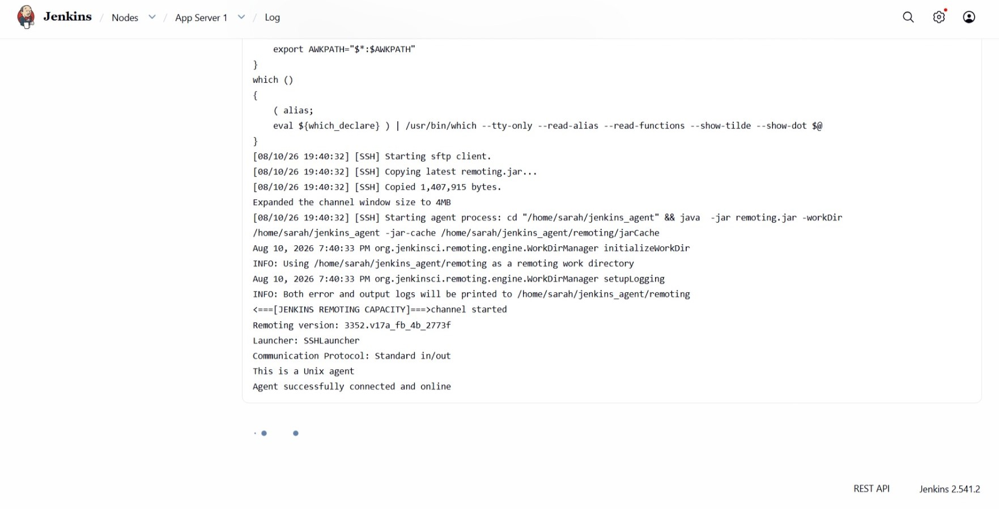
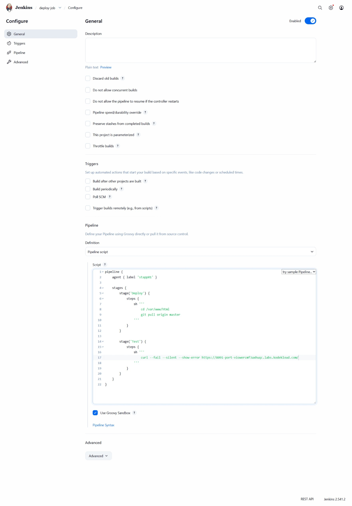
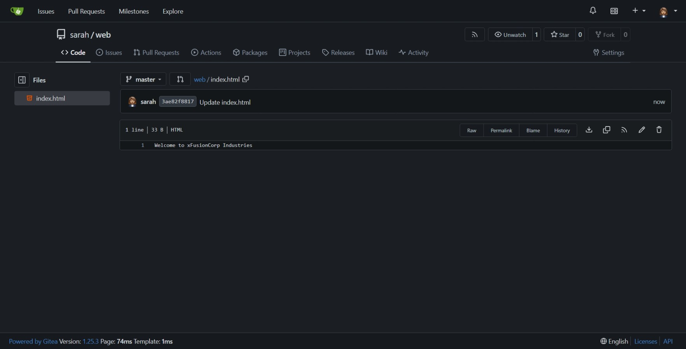
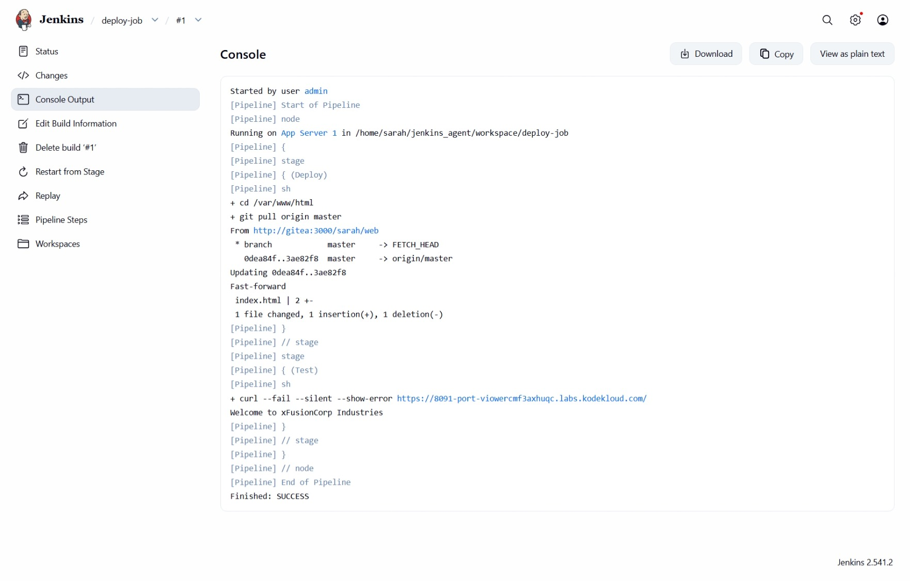
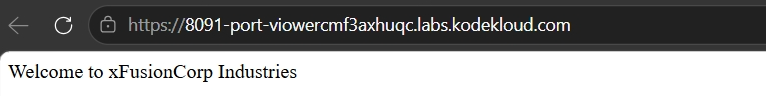
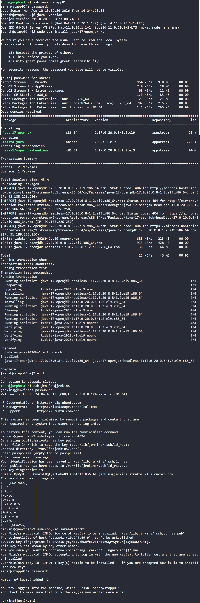

# Day 81: Jenkins Multistage Pipeline


## Objective
The objective is to create a professional CI/CD workflow using a Jenkins Multistage Pipeline. I configured a process that not only deploys the latest code from Gitea to App Server 1 (`stapp01`) but also automatically runs a verification test to ensure the website is healthy and reachable through the load balancer.


**Fail-Fast Mechanism**

I used the `curl --fail` flag for testing. Usually, if a website is down, `curl` simply shows an error message but tells Jenkins the command "finished." Adding `--fail` forces the command to return an error code, which tells Jenkins to mark the entire build as a failure. This prevents "silent failures" where a deployment looks successful but the website is actually broken.

## 1. Prepared the Environment
I logged into App Server 1 to update the Java runtime and established a trust relationship so the Jenkins Master can manage the server automatically.

```bash
# On stapp01: Upgraded Java for Jenkins Agent compatibility
sudo yum install -y java-17-openjdk

# On Jenkins Server: Setup passwordless SSH for the jenkins user
sudo su - jenkins
ssh-keygen -t rsa -b 4096 -N ""
ssh-copy-id sarah@stapp01
```


## 2. Configured Jenkins Agent Node

I first installed the plugins:



I then added App Server 1 as a dedicated worker in the Jenkins UI. This ensures that the deployment commands execute directly on the web server hardware.

*   **Name:** `App Server 1`
*   **Label:** `stapp01`
*   **Remote Root:** `/home/sarah/jenkins_agent`
*   **Launch Method:** SSH (using Sarah's credentials)






## 3. Developed the Multistage Pipeline
I created a Pipeline job named `deploy-job` and wrote the following Groovy script to define the workflow.

```groovy
pipeline {
    agent { label 'stapp01' }

    stages {
        stage('Deploy') {
            steps {
                sh '''
                    cd /var/www/html
                    git pull origin master
                '''
            }
        }

        stage('Test') {
            steps {
                # Use --fail to ensure the stage crashes if the URL returns an error
                sh 'curl --fail --silent --show-error http://stlb01:8091'
            }
        }
    }
}
```




## 4. Triggered the Pipeline

After creating the pipeline, I made a new commit to the `sarah/web` repository in Gitea to simulate a new code change.




I then manually triggered the `deploy-job` from Jenkins to start the deployment process.



Both stages completed successfully:

* **Deploy**: pulled the latest changes from the `master` branch into `/var/www/html`.
* **Test**: ran the `curl --fail` health check against the load balancer URL.

Both stages finished with a green status.

Finally, I clicked the **App** button to access the website through the load balancer. I confirmed that the latest content was displayed correctly at the main URL. The page displayed:

`Welcome to xFusionCorp Industries`

This confirmed that the deployment was successful and that the application was accessible through the load balancer.




## Screenshot
