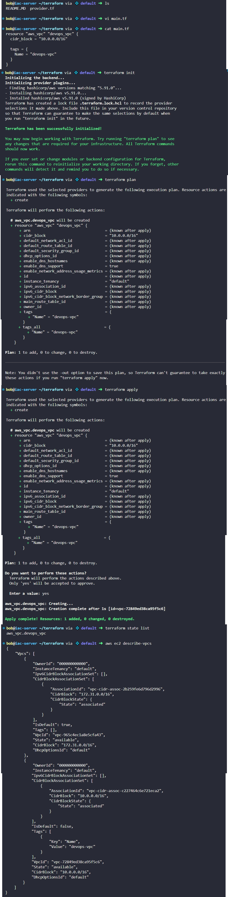

# Day 94: Create VPC Using Terraform

## Objective
The objective is to begin the infrastructure migration to AWS by programmatically provisioning a Virtual Private Cloud (VPC) using Terraform. I created a dedicated network environment named `devops-vpc` to serve as the foundation for future cloud resources.

## 1. Infrastructure as Code (IaC)

**The Blueprint (Terraform)**
Terraform is like a **Digital Blueprint**. In the past, if we wanted a network in AWS, we had to log into a website and click dozens of buttons. With Terraform, we write a text file that describes exactly what we want. This is called **Declarative Configuration**. we don't tell AWS "how" to build the network; we just tell Terraform the "end result" we want, and Terraform handles the communication with the AWS API to make it happen.

**The VPC (Virtual Private Cloud)**
A VPC is a n isolated section of the AWS network in the AWS cloud where we have total control over IP addresses, subnets, and routing. By defining a **CIDR block** (like `10.0.0.0/16`), we are deciding the size of the VPC and how many "addresses" (IPs) are available for my servers to use.

**The State File**
When we run Terraform, it creates a file called `terraform.tfstate` for Idempotency. This is Terraform's **Memory**. It remembers exactly what it built so that if we run the code again, it knows it doesn't need to build a second VPC, but rather just check if the existing one is still correct.

## 2. Developed the Terraform Manifest
I created the `main.tf` file in the `/home/bob/terraform` directory to define the AWS provider in `provider.tf` and the VPC resource.

```hcl
# main.tf

# Define the VPC resource
resource "aws_vpc" "devops_vpc" {
  cidr_block = "10.0.0.0/16"

  tags = {
    Name = "devops-vpc"
  }
}
```

## 3. Initialized and Applied the Configuration
I executed the standard Terraform workflow to transform the code into actual infrastructure.

```bash
# 1. Initialize the directory (Downloads the AWS plugin)
terraform init

# 2. Preview the changes
terraform plan

# 3. Create the VPC in AWS
terraform apply -auto-approve
```

## 4. Verification
I used both the Terraform state tool and the AWS Command Line Interface (CLI) to confirm the VPC was active and correctly named.

```bash
# Check Terraform's internal memory
terraform state list

# Check the actual AWS environment
aws ec2 describe-vpcs
```

### Result
I verified that the VPC was successfully created with the following attributes:
*   **VpcId:** `vpc-72849ed38ca95f5c6`
*   **CIDR Block:** `10.0.0.0/16`
*   **Name Tag:** `devops-vpc`

The VPC is now ready, and the first step of the cloud migration is complete.

## Screenshot
