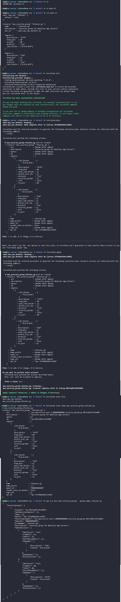

# Day 95: Create Security Group Using Terraform

## Objective
The objective is to provision an AWS Security Group named `xfusion-sg` using Terraform. This security group serves as a virtual firewall for the application servers, controlling inbound traffic to allow standard web access (HTTP) and remote management (SSH) while ensuring the resource is correctly attached to the default VPC.

## 1. Security Groups

A **Security Group** acts as a virtual firewall for AWS resources such as EC2 instances. It controls which inbound and outbound network traffic is allowed through a set of rules.

### Inbound Rules (Ingress)

I configured two inbound rules:

1. **HTTP (Port 80):** Allows HTTP traffic from any IPv4 address (`0.0.0.0/0`), enabling access to a web server.
2. **SSH (Port 22):** Allows SSH connections from any IPv4 address (`0.0.0.0/0`) for remote administration.

### Data Sources

The Security Group had to be created in the **Default VPC**. Instead of hardcoding the VPC ID, I used a Terraform **data source** to retrieve the existing Default VPC dynamically and pass its ID to the Security Group.

This avoids hardcoding environment-specific resource IDs and makes the configuration more reusable.


## 2. Developed the Terraform Manifest
I created the `main.tf` file to define the data lookup and the security group resource with its specific rules.

```hcl
# main.tf

# Find the default VPC ID automatically
data "aws_vpc" "default" {
  default = true
}

# Create the Security Group
resource "aws_security_group" "xfusion_sg" {
  name        = "xfusion-sg"
  description = "Security group for Nautilus App Servers"
  vpc_id      = data.aws_vpc.default.id

  # Allow Web Traffic
  ingress {
    description = "HTTP"
    from_port   = 80
    to_port     = 80
    protocol    = "tcp"
    cidr_blocks = ["0.0.0.0/0"]
  }

  # Allow Remote Management
  ingress {
    description = "SSH"
    from_port   = 22
    to_port     = 22
    protocol    = "tcp"
    cidr_blocks = ["0.0.0.0/0"]
  }
}
```

## 3. Deployment Workflow
I initialized the environment and applied the configuration to the AWS cloud.

```bash
# Prepare the working directory
terraform init

# Review the planned infrastructure changes
terraform plan

# Execute the creation of the security group
terraform apply -auto-approve
```

## 4. Verification
I verified the success of the operation by checking Terraform's state and querying the AWS API directly via the CLI.

```bash
# Check if the resource is in Terraform's memory
terraform state list

# Check the actual rules in the AWS cloud
aws ec2 describe-security-groups --group-names xfusion-sg
```

### Result
I verified that the `xfusion-sg` was successfully created. The AWS CLI output confirmed that both the **SSH** and **HTTP** rules are active and mapped to the correct VPC (`vpc-7674dbbd2d6ce3668`). The virtual firewall is now correctly configured to protect the Nautilus application servers.

## Screenshot
