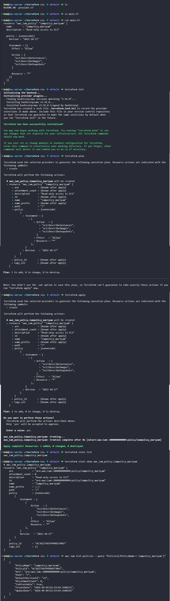

# Day 97: Create IAM Policy Using Terraform

## Objective
The objective is to create a custom AWS Identity and Access Management (IAM) policy named `iampolicy_mariyam`. This policy is designed to give a user named Mariyam read-only permissions for the EC2 console, allowing her to view instances, images, and snapshots without the ability to modify or delete them.

## 1. IAM Policies

An **IAM policy** is a JSON document that defines which AWS actions are allowed or denied for an identity.

### Policy Structure

An IAM policy mainly defines three elements:

1. **Effect:** Specifies whether the statement allows or denies an action. Usually `"Allow"` when granting permissions.
2. **Action:** Specifies the AWS API actions that are permitted. For example, `ec2:DescribeInstances` allows viewing information about EC2 instances.
3. **Resource:** Specifies which AWS resources the permission applies to. `*` means all applicable resources.

### Default Access

IAM follows a **default-deny model**. A user has no permissions unless an applicable policy grants them access.

### Read-Only Access & Least Privilege

For this task, the policy only grants EC2 `Describe` actions:

* `ec2:DescribeInstances`
* `ec2:DescribeImages`
* `ec2:DescribeSnapshots`

These actions allow users to retrieve information about EC2 resources without granting permissions to modify or delete them.

This follows the **Principle of Least Privilege**: grant only the permissions required for the intended task.


## 2. Developed the Terraform Manifest
I created the `main.tf` file to define the policy logic. I used the `jsonencode` function to ensure the policy document is formatted correctly for the AWS API.

```hcl
# main.tf

resource "aws_iam_policy" "iampolicy_mariyam" {
  name        = "iampolicy_mariyam"
  description = "Read-only access to EC2"

  # The policy document defining what is allowed
  policy = jsonencode({
    Version = "2012-10-17"
    Statement = [{
      Effect = "Allow"
      Action = [
        "ec2:DescribeInstances",
        "ec2:DescribeImages",
        "ec2:DescribeSnapshots"
      ]
      Resource = "*"
    }]
  })
}
```

## 3. Deployment Workflow
I ran the standard Terraform commands to provision the policy in the `us-east-1` region.

```bash
# Initialize and download the AWS provider
terraform init

# Review the plan to create 1 resource
terraform plan

# Apply the configuration to AWS
terraform apply -auto-approve
```

## 4. Verification
I verified that the policy exists in the cluster and queried the AWS IAM service directly to check the details.

```bash
# Check Terraform state
terraform state list

# Check the policy in AWS using the CLI
aws iam list-policies --query "Policies[?PolicyName=='iampolicy_mariyam']"
```

### Result
I verified that the `iampolicy_mariyam` was successfully created and assigned a unique Amazon Resource Name (ARN). The policy is now ready to be attached to the user account, providing the exact "view-only" access requested by the DevOps team.

## Screenshot
